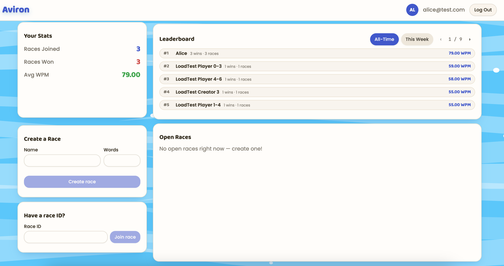
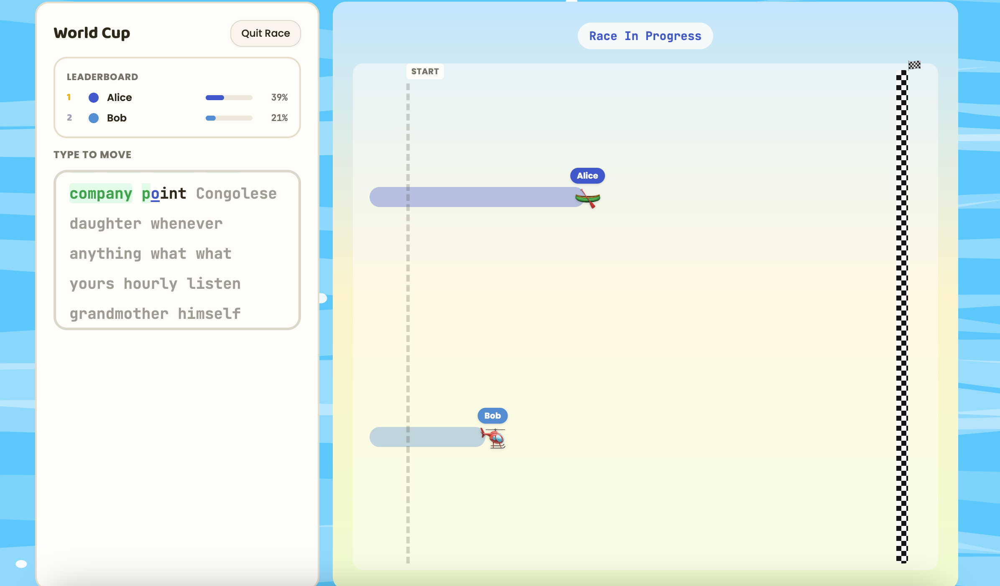

# Aviron

**Racing, reinvented for your keyboard.**

Aviron takes the thrill of a head-to-head race and turns it into something
anyone can jump into in seconds: a live, multiplayer typing race. Create a
room, invite your friends (or race total strangers), and see who can
out-type everyone else to the finish line — no equipment required, just
your keyboard.

## How to Play

1. **Create or join a race.** Pick a name and a target word count, or hop
   into a race a friend already started using its race ID.
2. **Everyone races the same prompt.** The moment a race starts, every
   player sees the exact same passage of text — nobody gets an easier
   route to the finish line.
3. **Type to move.** Every word you type correctly pushes your vehicle a
   little further down the track. Slack off, and you'll watch everyone
   else's cars, boats, and helicopters cruise right past you.
4. **First to the finish line wins.** The race ends the instant someone
   completes the full prompt — final standings and times are locked in
   for everyone else still racing.

## The Dashboard

Your home base: jump into an open race, start a new one, and see exactly
where you stand.



- **Your Stats** — a running tally of races joined, races won, and your
  average words-per-minute across every race you've played.
- **Leaderboard** — see how you stack up against everyone else, all-time
  or just this week.
- **Create a Race** — set a name and a target word count, and you've got a
  room ready for others to join.
- **Open Races** — no invite code needed; browse races other players have
  already started and jump straight in.

## The Race

Once a race starts, the dashboard gives way to the real action: a live
track where every player's progress updates instantly as they type.



- **A shared prompt** — the same passage of text for every racer, revealed
  a few words at a time so you always know what's coming next.
- **Live positions** — every correct keystroke nudges your vehicle closer
  to the checkered flag, and you can watch everyone else's progress in
  real time, right down to the percentage complete.
- **A finish line every race is racing toward** — the first racer to type
  the entire prompt correctly wins; everyone else's final rank and time
  are recorded the moment the race ends.

## Why Aviron

Not every competitive itch needs a gym membership. Aviron is for anyone
who wants the rush of a real race — the tension of watching an opponent
creep up behind you, the satisfaction of crossing the line first — packed
into the two minutes it takes to type a passage of text.

## Architecture

Aviron is a real-time multiplayer backend: many players racing together,
staying in sync in near real time even though they can connect through
different servers, on machines that come and go.

```text
                              ┌───────────────┐
                              │    Browser    │
                              │    (React)    │
                              └───────────────┘
                                      │  REST + WebSocket
                                      ▼
                              ┌───────────────┐
        ┌────────────────▶    │  ws-gateway   │
        |                     │ × M instances │
        |                     └───────────────┘
        |                             │  proxies REST round-robin,
        |                             |  terminates every WebSocket itself
        |                             ▼
        |                     ┌───────────────┐
        |                     │     NATS      │
        |                     │               │
        |                     └───────────────┘
        |                             │  room.<race_id>.in  (player input)
        |                             |  room.<race_id>.out (live state)
        |                             ▼
        |                     ┌───────────────┐
        |                     │ race-service  │
        |                     │ × N instances │
        |                     └───────────────┘
        |                             │  one "room actor" goroutine per
        |                             |  race, 250ms broadcast tick
        |                             │
        |             ┌───────────────┼───────────────┐
        |             ▼               ▼               ▼
        |     ┌──────────────┐┌──────────────┐┌──────────────┐
        └──── │    Redis     ││  PostgreSQL  ││    Kafka     │
              └──────────────┘└──────────────┘└──────────────┘
               room ownership  users, races,          │
               registry        results                |
                                     ▲                ▼
                                     |        ┌──────────────┐
                                     └────────│   consumer   │
                                              └──────────────┘
                                                      batches events into
                                                      PostgreSQL, async
```

**Real-time sync — the "room actor" pattern.** Each live race is owned by
exactly one goroutine on exactly one `race-service` instance: a single
writer that owns all of that race's state, fed through a channel, so there
are no locks and no shared-memory data races to reason about. It ticks on
a fixed 250ms interval and broadcasts the latest standings to everyone in
the race, decoupled from how often any individual player actually sends
input — a client only sends a `telemetry` message once per word typed
correctly (`join_race`/`telemetry`/`leave_race` are the only message types
a client ever sends).

**Why `ws-gateway` exists at all.** A browser's WebSocket connection can
land on a different `race-service` instance than the one actually running
that race — there's no way to route a browser straight to "the right"
backend before it connects. `ws-gateway` solves this by never holding race
state itself: it just terminates the socket and relays decoded messages
over NATS to whichever instance owns the room, and relays that instance's
broadcasts back out. From a player's point of view, it doesn't matter which
of the two gateways they connect through, or which of the two backends
owns their race — the result looks identical either way (see
`load/multi-instance-check.md` for how this is actually verified against a
real two-gateway, two-backend cluster).

**Reconnection.** A dropped WebSocket doesn't remove a player from their
race immediately — `race-service` marks them disconnected and holds their
seat for a 30-second grace period, keyed off a per-race `session_token`
(separate from the login JWT) so a reconnect doesn't require logging in
again.

**Redis** is the horizontal-scaling glue, not a cache: `roomlocator` tracks
which `race-service` instance currently owns each race
(`room:<race_id>` → instance address, refreshed on a heartbeat) so
`ws-gateway` knows where to route REST calls, plus a small evicted-players
set so a reconnect attempt after the grace period expires is rejected
cleanly instead of silently re-admitted.

**PostgreSQL** is the system of record — finishing a race is one
transaction that updates the race's status, writes every participant's
result, and updates their all-time stats.

**Kafka** decouples the live race path from anything that isn't strictly
required to keep it running: telemetry (`workout.sample`) and final results
(`race.finished`) are published as events, and a standalone consumer
(`backend/cmd/consumer`) batches them into PostgreSQL asynchronously
instead of adding a synchronous write to the room actor's own hot path.

**Observability.** `race-service` exposes Prometheus metrics at
`GET /metrics` (active room count, tick latency, inbox/broadcast channel
buffer usage — direct visibility into the concurrency model above) and
structured JSON logs tagged with `race_id`/`user_id` throughout.

Running two instances each of `race-service` and `ws-gateway` (the default
in `docker-compose.yml`) is what actually proves the design: any player can
connect through either gateway and still see consistent, real-time state,
no matter which backend owns their race.

## Install and Run

### Prerequisites

- [Docker](https://www.docker.com/) with Compose
- [Node.js](https://nodejs.org/) and [Yarn](https://yarnpkg.com/) (frontend)

### 1. Start the backend

From the repo root:

```sh
docker compose up -d --build
```

This builds and starts everything the backend needs: PostgreSQL, Redis,
NATS, Kafka, two `race-service` instances, `ws-gateway`, and the Kafka
consumer — database migrations run automatically on startup, no separate
step needed. Give it a few seconds, then confirm everything is healthy:

```sh
docker compose ps
```

`ws-gateway` is the single entry point for both REST and WebSocket
traffic, reachable at `http://localhost:9090`.

### 2. Start the frontend

```sh
cd frontend
yarn install
cp .env.example .env
```

Open `.env` and point `VITE_API_URL` at the gateway from step 1:

```text
VITE_API_URL=http://localhost:9090
```

Then run:

```sh
yarn dev
```

Open `http://localhost:5173` and create an account to start playing.

### Extras

- **pgAdmin**, a Postgres GUI, is available at `http://localhost:5050`
  (`admin@aviron.local` / `admin`), pre-connected to the local database.
- `docker compose down -v` stops everything and resets all data, including
  the database, for a clean slate.
- See `load/README.md` for k6 load testing and
  `load/multi-instance-check.md` for the multi-instance verification
  script.
