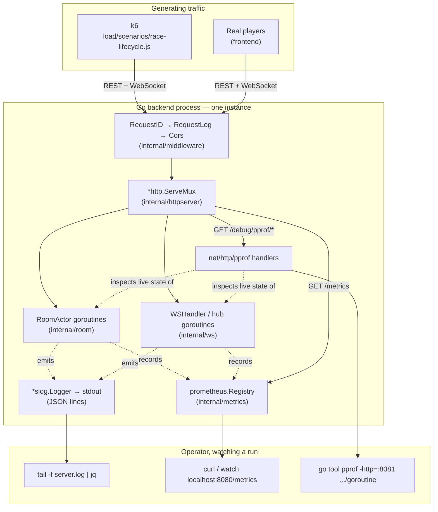
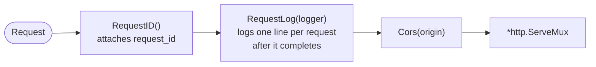
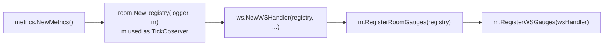
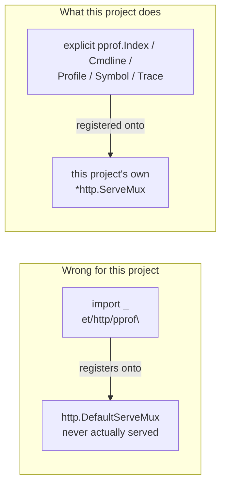
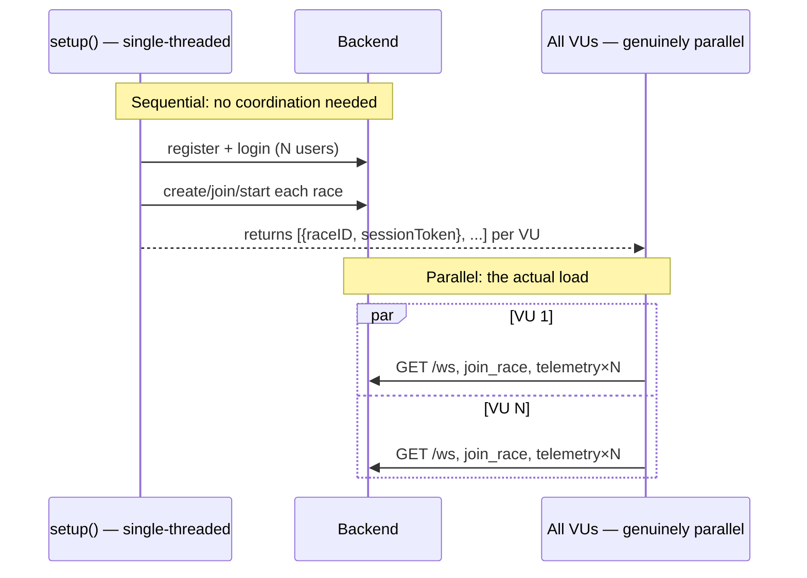
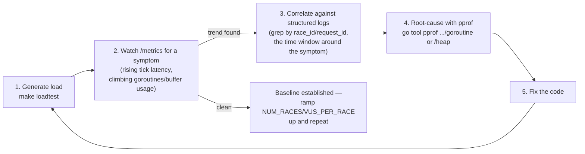
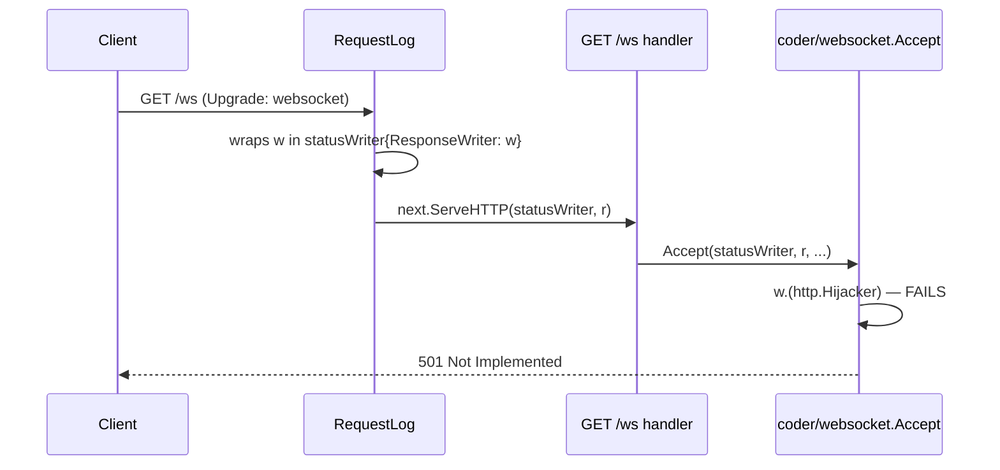
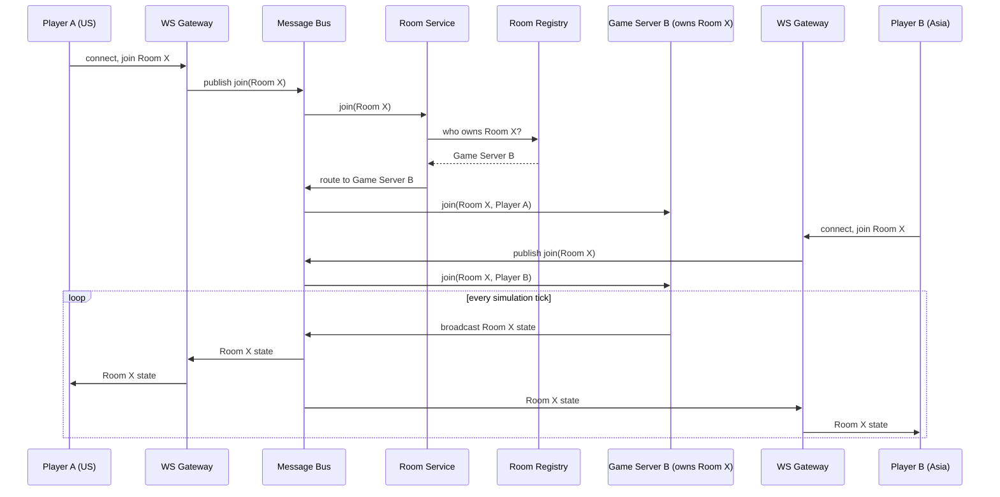
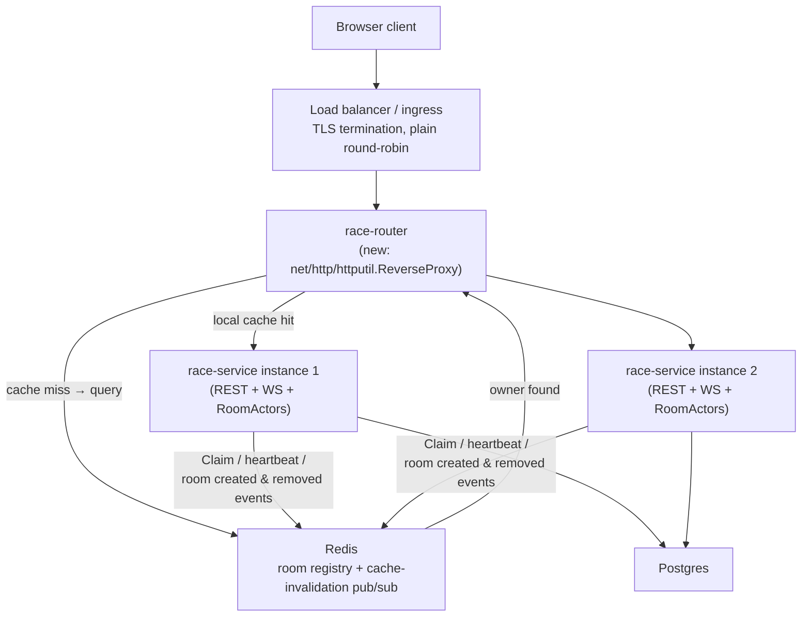
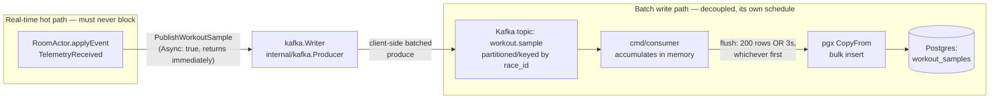

# Knowledge Summary

Architectural reference for this project, organized by phase rather than by individual commit — see `docs/feature-log.md` for the chronological, per-feature history.

## Phase 3: Observability

### The problem this phase solves

A single-instance Go backend with goroutine-per-room and goroutine-per-connection concurrency (Phase 2) can fail in ways that are basically invisible from reading the code: a goroutine leak that only shows up after thousands of connect/disconnect cycles, a channel that starts backing up only once enough rooms are active at once, a broadcast tick that quietly gets slower as the room count grows. None of that is reproducible by staring at source — it only exists *at runtime, under load*. Phase 3 built the tooling to see it when it happens, and Phase 3's own load-testing step is what actually produced load worth watching.

Four pieces, each answering a different question:

| Component | Type | Question it answers | Where the data lives |
| --- | --- | --- | --- |
| Structured logging (`slog`) | Event stream | "What happened, in what order, for this one request/race/connection?" | stdout, one JSON object per line — not persisted anywhere by this project |
| Prometheus metrics (`GET /metrics`) | Aggregate numbers over time | "Is something trending wrong, right now, in aggregate?" | In-process counters/gauges/histograms, scraped on demand — no time-series database deployed |
| pprof (`GET /debug/pprof/*`) | Point-in-time runtime snapshot | "Exactly which goroutine / code path / allocation is responsible?" | Captured live from the Go runtime at request time, never stored |
| k6 (`load/`) | Load generator | "Is there enough realistic concurrent traffic to make any of the above show something?" | External process; its own pass/fail summary at the end of a run |

This maps onto the classic "three pillars of observability" (logs, metrics, traces) with a deliberate substitution: this project has logs and metrics, but no distributed tracing (`opentelemetry-tracing.md` is listed as optional in `context/project-overview.md` §9 and was never built — a single-instance backend has no cross-service request to trace yet). In its place, **pprof** fills the "what exactly is happening inside the process right now" role that tracing would normally help with in a multi-service system. k6 isn't an observability tool at all — it's the load generator that makes the other three worth having; without genuinely concurrent traffic, logs/metrics/pprof have nothing interesting to show.

### Architecture — the whole picture

Every observability surface lives inside the same Go process (`cmd/server`) as the application itself — there's no separate collector, no sidecar, no external log/metrics store. Two different audiences read the process's output: real players (over REST/WebSocket, the actual product), and an operator running a load test who reads logs, metrics, and profiles directly.



### Why this design, specifically

- **No Prometheus server, no Grafana.** `GET /metrics` exists, but nothing scrapes or stores it over time — an operator reads it directly (`curl`, `watch`) during a run. Standing up a real Prometheus+Grafana stack is real infrastructure work with no payoff yet: this is a single instance, there's no fleet to aggregate across, and no on-call rotation to alert. That becomes worth it once Phase 4's horizontal scaling (≥2 instances, Redis-backed room ownership) makes "which instance is unhealthy" a real question — right now there's only one instance to ever be unhealthy.
- **No centralized log aggregation.** Structured JSON to stdout is enough at this scale — `tail -f | jq` or grepping `server.log` covers everything a real aggregator (Loki, ELK) would add, without another moving piece to run locally.
- **pprof is gated behind an env var (`PPROF_ENABLED`, default `true`), not always-on unconditionally.** It's unauthenticated (no JWT concept applies to an operator tool), so a hypothetical real deployment needs the option to turn it off or put it behind network-level access control — the gate exists so that's a config flip, not a code change, when that day comes.
- **Every custom Prometheus metric is prefixed `aviron_`** and none carry a `race_id`/`user_id` label — Prometheus accumulates one permanent label value per distinct value ever seen, so a per-race label would mean unbounded cardinality growth for as long as the process runs. Deliberately avoided, not discovered by accident later.
- **k6 over a hand-written Go load client** — native WebSocket support, and a REST-setup-then-WS-session flow is exactly its intended shape; using it avoids maintaining a second load-generation codebase alongside the real backend.

### Component 1: Structured logging

Every log line is a single JSON object, tagged with up to three correlation IDs, so one request's or one room's story can be reconstructed from the log stream alone:

| Tag | Scopes a line to | Where it comes from |
| --- | --- | --- |
| `request_id` | One HTTP request | `middleware.RequestID()`, `crypto/rand`-generated, echoed back as `X-Request-ID` |
| `race_id` | One race room | A child logger (`logger.With(...)`), tagged once when the room actor is spawned |
| `user_id` | One authenticated caller | `middleware.Auth`, or a WebSocket connection's own child logger |

The middleware chain, outermost to innermost — `RequestID` runs first so even a request that fails auth or CORS still gets an id:



`RoomActor` and `WSHandler` don't repeat `race_id`/`user_id` at every call site — each is handed a logger pre-tagged once, at construction:

```go
// internal/room/registry.go — Registry.Spawn
roomLogger := reg.logger.With(slog.String("race_id", raceID))
actor := NewRoomActor(ctx, raceID, distanceMeters, ..., roomLogger, ...)
```

A real captured log line (`GET /races/.../join`, authenticated):

```json
{"time":"2026-07-23T14:02:11+07:00","level":"INFO","msg":"http_request","method":"POST","path":"/races/9f2kD8mQvxaB/join","status":200,"duration":1372000,"request_id":"a13f9c02e4b7419dbb6f0a3c8e21d9f4","user_id":"7c1e2b3a-9f4d-4e2a-8b3c-1d2e3f4a5b6c"}
```

### Component 2: Prometheus metrics

`GET /metrics` exposes 4 custom metrics plus the standard Go runtime/process collectors (which already cover goroutine count for free, so no duplicate custom gauge exists for it):

| Metric | Type | What it means |
| --- | --- | --- |
| `aviron_rooms_active` | Gauge | Race rooms currently running |
| `aviron_connections_active` | Gauge | WebSocket connections currently being served |
| `aviron_channel_buffer_used{channel="inbox"\|"broadcast"\|"conn"}` | Gauge | How full each internal queue is, summed across every room/connection |
| `aviron_tick_latency_seconds` | Histogram | How long one room's 250ms broadcast tick takes to execute |
| `go_goroutines`, `go_gc_duration_seconds`, `process_cpu_seconds_total`, ... | Gauge / Summary / Counter | Standard runtime collectors, registered for free |

Construction has a real ordering constraint: the room registry needs a metrics handle before it exists (to report tick latency), but the room/connection gauges need the registry and WebSocket handler to exist first — each side needs the other. Resolved by building the metrics object first (zero dependencies), handing it to the registry as a `TickObserver`, then wiring the scrape-time gauges once everything else exists:



`internal/room` never imports `internal/metrics` — `TickObserver` is a one-method interface defined in `internal/room` itself, satisfied structurally by `*metrics.Metrics`, the same pattern this codebase already uses for `RaceFinisher`/`RaceLeaver`/`RaceCanceller`:

```go
// internal/room/room.go
type TickObserver interface {
    ObserveTick(d time.Duration)
}
```

### Component 3: pprof

`net/http/pprof`'s `init()` registers its handlers onto Go's *global* `http.DefaultServeMux` the moment it's imported — a well-known trap, since this project (like most real servers) builds its own separate `*http.ServeMux` and never serves the default one. A blank `import _ "net/http/pprof"` would compile clean and register nothing reachable:



Exactly 5 handlers cover every profile — `pprof.Index`, registered at the trailing-slash pattern `/debug/pprof/`, dispatches every named profile itself:

| Path | Handler | Serves |
| --- | --- | --- |
| `/debug/pprof/` | `pprof.Index` | Index page, plus `goroutine`/`heap`/`allocs`/`block`/`mutex`/`threadcreate` via its own dispatch |
| `/debug/pprof/cmdline` | `pprof.Cmdline` | The process's command-line invocation |
| `/debug/pprof/profile` | `pprof.Profile` | CPU profile, sampled over `?seconds=N` |
| `/debug/pprof/symbol` | `pprof.Symbol` | Program counter → function name lookups |
| `/debug/pprof/trace` | `pprof.Trace` | Execution trace, over `?seconds=N` |

Gated behind `Config.PprofEnabled` and registered unrestricted by HTTP method (unlike every other route in this codebase) — `pprof.Symbol` genuinely needs both `GET` and `POST`.

Usage — a browser only shows raw numbers; the real tool is the CLI:

```sh
# Interactive shell: top, list <func>, web
go tool pprof http://localhost:8080/debug/pprof/goroutine

# Best for this project: launches pprof's own web UI (flame graph, graph view)
go tool pprof -http=:8081 http://localhost:8080/debug/pprof/goroutine

# Diff two snapshots to find exactly what leaked between them
go tool pprof -base=before.pb.gz after.pb.gz
```

### Component 4: k6

`load/scenarios/race-lifecycle.js` simulates the full real client flow — register, log in, create/join/start a race, the real `GET /ws` handshake, paced `telemetry` matching the frontend's exact WPM formula. The one real design constraint: k6 virtual users (VUs) are independent JS runtimes with no cross-VU communication at runtime, so "one VU creates a race, others join it" (as the spec literally described it) isn't achievable without external coordination infrastructure this project doesn't have. Resolved by moving all REST setup into k6's `setup()` — single-threaded, runs once before any VU executes — leaving only the genuinely-concurrent part (every VU's WebSocket connection and telemetry stream, the actual load-generating traffic) to run in parallel:



Scale knobs, tunable via `-e` without editing the script:

| Variable | Default | Meaning |
| --- | --- | --- |
| `NUM_RACES` | `5` | Concurrent races |
| `VUS_PER_RACE` | `8` | Participants per race (`<= race.MaxParticipants` = 10) |
| `DISTANCE_METERS` | `30` | Target word count — how long each race lasts |

### How they work together — the diagnostic loop

This is the actual point of building all four: a repeatable loop for turning "something feels slow" into "here's the exact line of code and the fix."



The one signal worth watching most closely at step 2: a gauge (`aviron_rooms_active`, `go_goroutines`) that keeps climbing *after* every VU has disconnected, not just during the run — that's the concrete signature of a leak, as opposed to load.

### Different failure modes surface through different tools first

Not every problem needs the full loop above — a hard failure and a slow degradation look completely different at step 2, and knowing which tool actually caught it first matters:

| Failure mode | First signal | Tool that catches it fastest |
| --- | --- | --- |
| Hard failure (every request/connection rejected outright) | k6's own checks/summary fail immediately | k6's pass/fail output + one structured-log status field |
| Slow degradation under sustained load | A gauge/histogram trending up over the course of one run | `/metrics` |
| Resource leak (never recovers after load stops) | A gauge that stays elevated after every VU has disconnected | `/metrics`, watched before/during/after |
| "Which exact code path is responsible" | N/A — always the follow-up question once one of the above fires | `pprof` |

### Case study: a real bug this actually caught

The first real `k6 run` against a live server got `501 Not Implemented` on every single WebSocket handshake — a hard failure, not a degradation, so it showed up immediately in k6's own output (`ws_session_duration avg=2ms`, sessions closing instantly) rather than needing a metrics trend or a pprof profile to notice. The structured request log confirmed it with one field:

```json
{"time":"2026-07-23T11:09:44+07:00","level":"INFO","msg":"http_request","method":"GET","path":"/ws","status":501,"duration":43250,"request_id":"110cd8f3b11deddeb5e6a952be10cfa0"}
```

Root cause, found by reading the `coder/websocket` library's own source once the symptom pointed squarely at the handshake: `RequestLog`'s `statusWriter` wraps `http.ResponseWriter` to capture the status code, but only embeds the 3-method `http.ResponseWriter` *interface* — not the concrete writer's full method set — so `http.Hijacker` (which a WebSocket upgrade requires, to take over the raw TCP connection) silently stopped being reachable through it. Since `RequestLog` wraps the entire mux, this had been breaking every real WebSocket connection — including real players', not just k6's — since the day Structured Logging shipped, undetected because `internal/ws`'s own tests exercise a fake connection, never a real `net/http` hijack:



Fixed by giving `statusWriter` its own `Hijack()` forwarding to the underlying writer. This is the honest lesson from building this whole system: pprof and Prometheus are built to answer "why is it slow" or "why is it leaking" — neither would have been the fastest path to a total connection failure. The right tool depended on the *shape* of the failure, not just having every tool available.

## Horizontally Scaling

**Status: planned (Phase 4), not yet implemented.** This section works through the architecture a real large-scale multiplayer game backend uses, why most of it doesn't fit a project at this scale, and the right-sized version actually planned for this codebase. Nothing below exists yet — no `internal/roomlocator`, `cmd/race-router`, or Redis dependency is in the code — this is design groundwork ahead of the build.

### The architecture researched for large-scale multiplayer games

Real-world, internet-scale multiplayer game backends (battle royale titles, MMOs) are built around one hard constraint this project doesn't have: a global, geographically distributed player base where connection latency to the nearest server matters as much as correctness does. That constraint produces a specific, layered shape:


| Component | Role | Why it exists |
| --- | --- | --- |
| Global DNS / Anycast | Routes a player's very first connection to whichever region is topologically closest to them | Minimizes the one latency cost a player feels on every packet for the rest of the session — worth solving once, at the network layer, rather than per-request |
| Regional LB | Spreads a region's connections across that region's pool of WS Gateways | HA and throughput within a region — no single gateway process is a bottleneck or a single point of failure |
| WS Gateway | Terminates the player's actual WebSocket connection; does lightweight auth, then forwards everything onto the message bus | Connection-holding (I/O-bound, scales with player count) and simulation (CPU-bound, scales with active-room count and per-room complexity) have different cost curves at real scale — splitting them lets each scale to its own bottleneck instead of over-provisioning one to satisfy the other |
| Message Bus (Redis/NATS/Kafka) | The transport between every Gateway and every backend service, regardless of which physical machine either side is on | A Gateway never needs to know which Game Server currently owns a given room, or even which region it's in — it just publishes/subscribes by room id and lets the bus deliver |
| Room Service | Tracks a room's lifecycle at the metadata level — which rooms exist, what state they're in | Separate from the Game Server itself so "does this room exist and what's its status" can be answered without touching the process actually running the simulation |
| Matchmaking | Groups players into a room by skill/region/queue rules *before* a room is created | A room-assignment decision that has to happen before there's a room id to route by at all |
| Presence | Tracks who's online/offline/in-a-room platform-wide | Feeds friends lists, invites, and notifications — a cross-cutting concern unrelated to any single room |
| Room Registry (Redis/Etcd/Consul) | The durable, authoritative map of room id → owning Game Server | Lets any Gateway, Room Service, or Matchmaking node discover the correct owner without hardcoding server topology anywhere |
| Game Server | The process actually running one room's simulation tick | One room (or a small number) per server, since real simulation — physics, AI, anti-cheat — is CPU/GPU-heavy enough that a server can only host so many at once |

How it works together, end to end: DNS sends a player to their nearest region → the regional LB picks any healthy Gateway in that region → the Gateway authenticates the connection and, once Matchmaking/Room Service assigns or looks up a room, consults the Room Registry to learn which Game Server owns it → from then on, all of that connection's game traffic flows Gateway ↔ Message Bus ↔ Game Server, with the room's actual state never leaving the Game Server process. Note that only the LB/Gateway tier is regional for latency reasons — the Message Bus and everything behind it (Room Service, Matchmaking, Presence, Room Registry, Game Servers) is one shared pool every region's Gateways reach through the same bus, which is exactly what makes the cross-region join case below possible at all.

Step by step — two players landing on Gateways in **different regions**, joining the **same** room:



Neither Gateway ever talks to Game Server B directly, and neither player's region matters once the Room Registry has answered "who owns this room" once — every subsequent tick flows through the same Message Bus regardless of where each Gateway physically sits.

### Why not every component fits this project

| Component | Verdict for this project | Reasoning |
| --- | --- | --- |
| Global DNS / Anycast, regional split | **Drop entirely** | Solves cross-continent latency for a worldwide player base. This project has no multi-region requirement — one deployment, one set of users, collapses to nothing. |
| Regional LB | **Simplify to one LB** | Same job, just singular — one load balancer in front of the whole instance pool, not one per region. |
| WS Gateway as a tier separate from the Game Server | **Merge into one tier** | The split only earns its cost when connection-load and simulation-load scale at genuinely different rates. `RoomActor.Run()` here is a `select` loop mutating a small struct and marshaling a JSON snapshot every 250ms — no physics, no AI, nothing CPU-bound. Room count and connection count scale together almost 1:1 (max 10 participants per race), so there's no divergent curve to split apart. Splitting would also mean *every* message pays a message-bus hop, not just the cross-instance case — strictly worse here. |
| Message Bus | **Keep, but in a narrower role** | See "Our approach" below — used for keeping a routing cache warm, not for relaying every in-flight game message. |
| Room Service | **Keep, but merged into the existing tier** | This is exactly `internal/room.RoomActor` + `Registry` — already built, already living inside `race-service` itself, not a separate microservice. |
| Matchmaking | **Drop entirely** | No automatic/skill-based matchmaking exists or is planned — races are manually created, joined by id, or browsed from a list. Nothing in this project's scope needs it. |
| Presence | **Drop entirely** | No cross-room, platform-wide "who's online" feature exists or is planned. Per-room connected/disconnected state is already handled by `RoomActor`'s own `disconnected_at`/`evicted` tracking, which is all this project needs. |
| Room Registry | **Keep — maps directly** | This is `redis-room-registry.md`'s `SET room:<id> instance:<id> NX EX 60` design, already planned for Phase 4. |
| Game Server (dedicated process per room) | **Simplify to a goroutine** | A real game server needs a whole process/container per room because simulation is CPU-heavy. A typing race's room actor is cheap enough that many rooms share one `race-service` process — no per-room server needed. |

### Our approach for this project

Right-sized version: one region, one LB, one merged connection-and-simulation tier, and a Redis registry doing double duty — but the biggest change from what this project's Phase 4 specs originally planned is *how* a client actually reaches the instance that owns their room.

`cross-instance-relay.md` (the existing Phase 4 spec) relays every individual client message through Redis pub/sub for the lifetime of a cross-instance connection — explicitly flagged in that spec as *"the hardest and highest-risk spec in the entire project"*. The design below avoids that entirely: instead of relaying messages after the fact, route the connection to the correct instance **once, up front**, and let everything after that be ordinary local traffic.



- **Room ownership is still decided by construction**, exactly as today: whichever instance handles `POST /races` becomes the owner and claims it in Redis (`redis-room-registry.md`'s `SET room:<id> instance:<id> NX EX 60`, refreshed on a heartbeat). No hash formula ever decides ownership, so there's no ring-reshuffle-orphans-a-live-room risk to design around in the first place.
- **`race-router` replaces the message relay with a one-time routing decision.** It keeps a local in-memory cache of `race_id → instance`, kept warm by subscribing to Redis pub/sub for room-created/room-removed events, falling back to a direct Redis query on a cache miss. A request with no `race_id` (register/login/browse) skips all of this and goes round-robin to any healthy instance.
- **Once proxied, a connection is 100% local for its entire lifetime** — including the WebSocket's full duration. `internal/room`/`internal/ws` need no relay-awareness at all; `cross-instance-relay.md`'s `Relay.Dispatch`/`SubscribeOut`/eviction-mirroring machinery becomes unnecessary and is superseded by this design, not layered on top of it.
- **Message Bus's role shrinks accordingly**: Redis pub/sub here only carries small, infrequent "room created"/"room removed" notifications to keep `race-router`'s cache warm — not the high-frequency per-tick `race_state` traffic the original relay design would have pushed through it.
- **Graceful draining on scale-down**: an instance being removed is marked not-ready for *new* room placement immediately, but keeps serving rooms it already owns until they finish or a bounded drain timeout elapses (`readinessProbe` + `preStop` + `terminationGracePeriodSeconds` — the same graceful-shutdown principle `project-overview.md` §7 already calls for, just extended from request-length to room-length timescales).
- **Redis itself should run as a Cluster with per-shard replication in a real deployment of this design** — the registry (and `race-router`'s cache-invalidation feed) becoming unavailable stops new joins/reconnects from resolving correctly, and a single node has no automatic failover. **For this project, a single Redis instance is implemented instead, deliberately, for simplicity** — the same category of accepted single-point-of-failure risk this project already carries for its one, non-HA Postgres instance. This is a disclosed scope decision, not an oversight, and the upgrade path (Sentinel or Cluster) is already known if it's ever needed.

## Event Pipeline: Kafka → Postgres

**Status: implemented** (`kafka-producer.md`, `kafka-consumer-postgres-sink.md` — Phase 4's `event-pipeline/` sub-area, both shipped 2026-07-26). This section answers a question worth asking explicitly rather than taking on faith: given that Postgres is still where telemetry ends up either way, what does routing it through Kafka first actually buy this project?

### The problem this solves

`RoomActor.applyEvent`'s `TelemetryReceived` case (`internal/room/room.go`) fires once per `telemetry` message a client sends — bounded by human typing speed, roughly every 0.4–2s per player (`project-overview.md` §4.2), but multiplied across every participant in every active room, across however many `race-service` instances Phase 4's horizontal scaling is running at once. That's a continuous, fan-in write workload with no natural batching unless something batches it, and it's arriving at exactly the place in this codebase that's least allowed to stall: `RoomActor.Run()`'s single-writer `select` loop, which also owns the room's 250ms broadcast tick (`room-actor-core.md`'s own single-writer principle — one blocked event delays every other event queued behind it in that room's `inbox`).

Two options if telemetry went straight to Postgres instead:

- **A synchronous `INSERT` per telemetry event, called directly from `applyEvent`.** The room actor's hot path would now pay a full network round trip plus a Postgres write on every keystroke any player sends, for a row that isn't even on the critical path of "keep connected clients in sync" — that's the broadcast tick, not row-level telemetry history.
- **Each room actor batches in memory itself before writing.** Now every room actor — and there can be many, per instance, across however many instances — needs its own flush-timer machinery, all independently contending for the same Postgres connection pool at flush time, duplicated N times instead of built once.

Kafka is the answer `project-overview.md` §6 already chose; the rest of this section is why that choice actually pays off, concretely, in this codebase.

### Architecture



### Why Kafka instead of a direct Postgres write helps this project scale

**It decouples the real-time hot path from Postgres's write throughput.** `PublishWorkoutSample` (`internal/kafka/producer.go`) is fire-and-forget: the underlying `kafka.Writer` is constructed with `Async: true`, so `WriteMessages` hands the message to an in-memory client-side buffer and returns immediately — it does not wait for the broker to actually persist or acknowledge it, let alone for Postgres to do anything. Because of that, this project can run many `race-service` instances at once (`server-a`, `server-b`, ... — Phase 4's horizontal scaling), each running any number of room actors, and *none of them ever contends directly with Postgres for a telemetry write*. That write pressure lands on Kafka instead — a system built specifically to absorb many concurrent producers cheaply as an append-only log.

The actual database write happens in exactly one place: `cmd/consumer`, batching up to 200 rows or 3 seconds' worth (whichever comes first) into a single `pgx.CopyFrom` bulk insert. Postgres ends up seeing a small, steady stream of large batch writes instead of a large, bursty stream of tiny individual ones scaling directly with `instances × rooms per instance × players per room`. And per §6's own reasoning ("a dedicated Go consumer group... so consumers can scale independently"): if telemetry volume ever outgrows one consumer, the fix is scaling the *consumer* side — more members in the same consumer group, more partitions — entirely independent of the real-time room-actor/WebSocket tier. Those two halves of the system have genuinely different scaling profiles (I/O-bound real-time fan-out vs. batch database write throughput), the same reasoning the "Horizontally Scaling" section above uses to justify splitting a WS Gateway from a Game Server — applied here to the write path instead of the connection path.

**This reasoning applies to `workout.sample` specifically, not `race.finished`.** `race.finished` stays a low-frequency event (one per race, not one per keystroke) whose correctness matters immediately, so it's never put through this batching/decoupling logic at all — `RaceService.FinishRace` still writes `races`/`race_participants`/`leaderboard_alltime` synchronously and transactionally, and `PublishRaceFinished` only fires *after* that write already succeeded. The Kafka consumer's own handling of `race.finished` is a narrow, idempotent reconciliation safety net (`ReconcileParticipantResults`, `WHERE finish_rank IS NULL`) for the rare case that synchronous write didn't happen — not a second primary writer, and not something this scaling argument is about. See `kafka-consumer-postgres-sink.md`'s own Overview for why that split isn't a dual-write hazard.

### Why a Kafka publish is mechanically cheaper than a Postgres `INSERT`

This is a separate claim from the async/non-blocking point above, and worth pulling apart from it: even ignoring that `PublishWorkoutSample` doesn't wait around, the unit of work Kafka eventually does per message is cheaper in kind than what Postgres does per row.

| | A Postgres `INSERT` (what `workout_samples` would need directly) | A Kafka partition append (what actually happens first) |
| --- | --- | --- |
| Parsing/planning | Full SQL parse + query plan | None — no query language involved |
| Constraints | Two foreign keys checked (`race_id → races.id`, `user_id → users.id`) | None |
| Durability | Write-ahead log record, then apply to the table and its indexes, then `fsync` (governed by `synchronous_commit`) | Sequential append to the end of a partition's log file |
| Indexing | `idx_workout_samples_race_user_ts` maintained on every insert | No index to maintain on write |
| Concurrency control | MVCC bookkeeping, row/page locking | None — an append-only log has no in-place updates to guard |

None of this replaces the eventual Postgres write — it still happens, via `CopyFrom`, and every row still lands in `workout_samples`. What Kafka buys is *reshaping* that write: instead of `N` small transactional inserts issued directly and concurrently from `N` room-actor goroutines (scaling with instance count × room count × player count), it becomes **one** large, efficient batch insert, issued by **one** process, on its own schedule, fully decoupled from the exact millisecond any specific player typed a specific word. `kafka-go`'s own `Writer` batches client-side before it ever talks to the broker too — the same "batch, don't do it one row at a time" principle `project-overview.md` §3 asks for at the database layer, just applied one hop earlier in the pipeline.
