# Knowledge Summary

Architectural reference for this project, organized by phase rather than by individual commit — see `docs/feature-log.md` for the chronological, per-feature history.

## Phase 3: Observability

### The problem this phase solves

A single-instance Go backend with goroutine-per-room and goroutine-per-connection concurrency (Phase 2) can fail in ways that are basically invisible from reading the code: a goroutine leak that only shows up after thousands of connect/disconnect cycles, a channel that starts backing up only once enough rooms are active at once, a broadcast tick that quietly gets slower as the room count grows. None of that is reproducible by staring at source — it only exists *at runtime, under load*. Phase 3 built the tooling to see it when it happens, and Phase 3's own load-testing step is what actually produced load worth watching.

Four pieces, each answering a different question:

| Component | Type | Question it answers | Where the data lives |
| --- | --- | --- | --- |
| Structured logging (`slog`) | Event stream | "What happened, in what order, for this one request/race/connection?" | stdout, one JSON object per line — not persisted anywhere by this project |
| Prometheus metrics (`GET /metrics`) | Aggregate numbers over time | "Is something trending wrong, right now, in aggregate?" | In-process counters/gauges/histograms, scraped on demand — no time-series database deployed |
| pprof (`GET /debug/pprof/*`) | Point-in-time runtime snapshot | "Exactly which goroutine / code path / allocation is responsible?" | Captured live from the Go runtime at request time, never stored |
| k6 (`load/`) | Load generator | "Is there enough realistic concurrent traffic to make any of the above show something?" | External process; its own pass/fail summary at the end of a run |

This maps onto the classic "three pillars of observability" (logs, metrics, traces) with a deliberate substitution: this project has logs and metrics, but no distributed tracing (`opentelemetry-tracing.md` is listed as optional in `context/project-overview.md` §9 and was never built — a single-instance backend has no cross-service request to trace yet). In its place, **pprof** fills the "what exactly is happening inside the process right now" role that tracing would normally help with in a multi-service system. k6 isn't an observability tool at all — it's the load generator that makes the other three worth having; without genuinely concurrent traffic, logs/metrics/pprof have nothing interesting to show.

### Architecture — the whole picture

Every observability surface lives inside the same Go process (`cmd/server`) as the application itself — there's no separate collector, no sidecar, no external log/metrics store. Two different audiences read the process's output: real players (over REST/WebSocket, the actual product), and an operator running a load test who reads logs, metrics, and profiles directly.

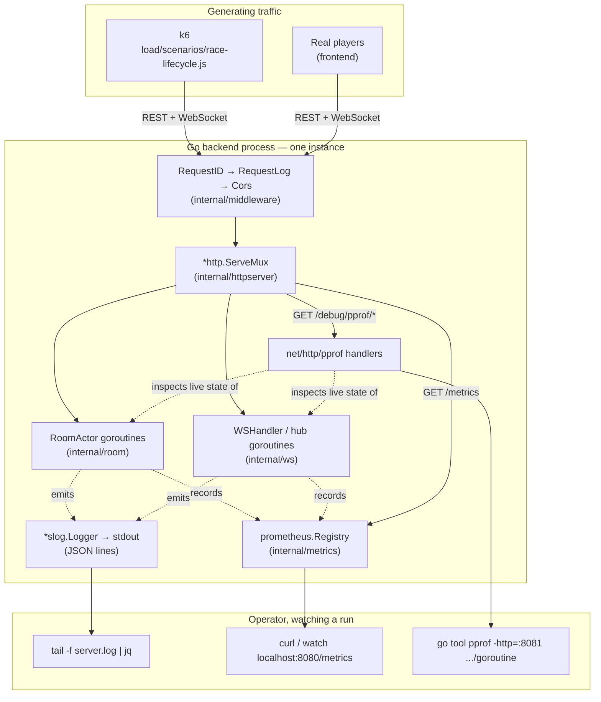

### Why this design, specifically

- **No Prometheus server, no Grafana.** `GET /metrics` exists, but nothing scrapes or stores it over time — an operator reads it directly (`curl`, `watch`) during a run. Standing up a real Prometheus+Grafana stack is real infrastructure work with no payoff yet: this is a single instance, there's no fleet to aggregate across, and no on-call rotation to alert. That becomes worth it once Phase 4's horizontal scaling (≥2 instances, Redis-backed room ownership) makes "which instance is unhealthy" a real question — right now there's only one instance to ever be unhealthy.
- **No centralized log aggregation.** Structured JSON to stdout is enough at this scale — `tail -f | jq` or grepping `server.log` covers everything a real aggregator (Loki, ELK) would add, without another moving piece to run locally.
- **pprof is gated behind an env var (`PPROF_ENABLED`, default `true`), not always-on unconditionally.** It's unauthenticated (no JWT concept applies to an operator tool), so a hypothetical real deployment needs the option to turn it off or put it behind network-level access control — the gate exists so that's a config flip, not a code change, when that day comes.
- **Every custom Prometheus metric is prefixed `aviron_`** and none carry a `race_id`/`user_id` label — Prometheus accumulates one permanent label value per distinct value ever seen, so a per-race label would mean unbounded cardinality growth for as long as the process runs. Deliberately avoided, not discovered by accident later.
- **k6 over a hand-written Go load client** — native WebSocket support, and a REST-setup-then-WS-session flow is exactly its intended shape; using it avoids maintaining a second load-generation codebase alongside the real backend.

### Component 1: Structured logging

Every log line is a single JSON object, tagged with up to three correlation IDs, so one request's or one room's story can be reconstructed from the log stream alone:

| Tag | Scopes a line to | Where it comes from |
| --- | --- | --- |
| `request_id` | One HTTP request | `middleware.RequestID()`, `crypto/rand`-generated, echoed back as `X-Request-ID` |
| `race_id` | One race room | A child logger (`logger.With(...)`), tagged once when the room actor is spawned |
| `user_id` | One authenticated caller | `middleware.Auth`, or a WebSocket connection's own child logger |

The middleware chain, outermost to innermost — `RequestID` runs first so even a request that fails auth or CORS still gets an id:


`RoomActor` and `WSHandler` don't repeat `race_id`/`user_id` at every call site — each is handed a logger pre-tagged once, at construction:

```go
// internal/room/registry.go — Registry.Spawn
roomLogger := reg.logger.With(slog.String("race_id", raceID))
actor := NewRoomActor(ctx, raceID, distanceMeters, ..., roomLogger, ...)
```

A real captured log line (`GET /races/.../join`, authenticated):

```json
{"time":"2026-07-23T14:02:11+07:00","level":"INFO","msg":"http_request","method":"POST","path":"/races/9f2kD8mQvxaB/join","status":200,"duration":1372000,"request_id":"a13f9c02e4b7419dbb6f0a3c8e21d9f4","user_id":"7c1e2b3a-9f4d-4e2a-8b3c-1d2e3f4a5b6c"}
```

### Component 2: Prometheus metrics

`GET /metrics` exposes 4 custom metrics plus the standard Go runtime/process collectors (which already cover goroutine count for free, so no duplicate custom gauge exists for it):

| Metric | Type | What it means |
| --- | --- | --- |
| `aviron_rooms_active` | Gauge | Race rooms currently running |
| `aviron_connections_active` | Gauge | WebSocket connections currently being served |
| `aviron_channel_buffer_used{channel="inbox"\|"broadcast"\|"conn"}` | Gauge | How full each internal queue is, summed across every room/connection |
| `aviron_tick_latency_seconds` | Histogram | How long one room's 250ms broadcast tick takes to execute |
| `go_goroutines`, `go_gc_duration_seconds`, `process_cpu_seconds_total`, ... | Gauge / Summary / Counter | Standard runtime collectors, registered for free |

Construction has a real ordering constraint: the room registry needs a metrics handle before it exists (to report tick latency), but the room/connection gauges need the registry and WebSocket handler to exist first — each side needs the other. Resolved by building the metrics object first (zero dependencies), handing it to the registry as a `TickObserver`, then wiring the scrape-time gauges once everything else exists:

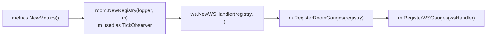

`internal/room` never imports `internal/metrics` — `TickObserver` is a one-method interface defined in `internal/room` itself, satisfied structurally by `*metrics.Metrics`, the same pattern this codebase already uses for `RaceFinisher`/`RaceLeaver`/`RaceCanceller`:

```go
// internal/room/room.go
type TickObserver interface {
    ObserveTick(d time.Duration)
}
```

### Component 3: pprof

`net/http/pprof`'s `init()` registers its handlers onto Go's *global* `http.DefaultServeMux` the moment it's imported — a well-known trap, since this project (like most real servers) builds its own separate `*http.ServeMux` and never serves the default one. A blank `import _ "net/http/pprof"` would compile clean and register nothing reachable:

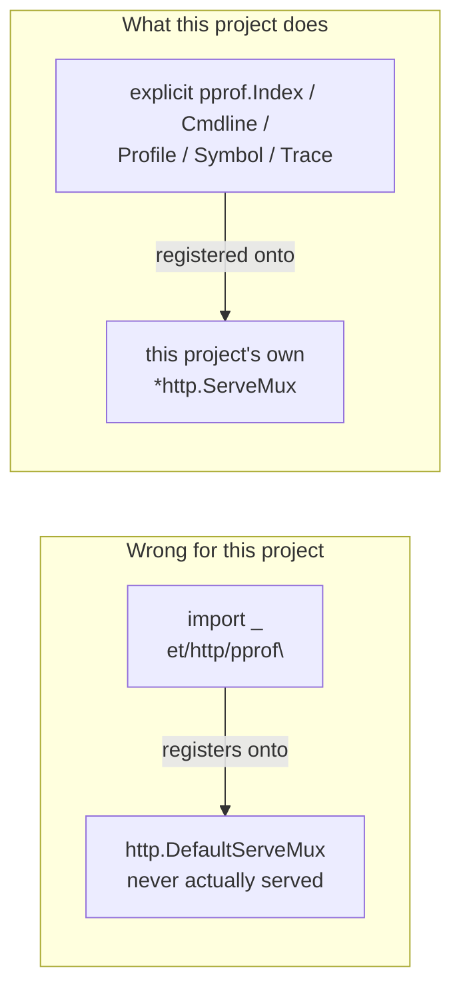

Exactly 5 handlers cover every profile — `pprof.Index`, registered at the trailing-slash pattern `/debug/pprof/`, dispatches every named profile itself:

| Path | Handler | Serves |
| --- | --- | --- |
| `/debug/pprof/` | `pprof.Index` | Index page, plus `goroutine`/`heap`/`allocs`/`block`/`mutex`/`threadcreate` via its own dispatch |
| `/debug/pprof/cmdline` | `pprof.Cmdline` | The process's command-line invocation |
| `/debug/pprof/profile` | `pprof.Profile` | CPU profile, sampled over `?seconds=N` |
| `/debug/pprof/symbol` | `pprof.Symbol` | Program counter → function name lookups |
| `/debug/pprof/trace` | `pprof.Trace` | Execution trace, over `?seconds=N` |

Gated behind `Config.PprofEnabled` and registered unrestricted by HTTP method (unlike every other route in this codebase) — `pprof.Symbol` genuinely needs both `GET` and `POST`.

Usage — a browser only shows raw numbers; the real tool is the CLI:

```sh
# Interactive shell: top, list <func>, web
go tool pprof http://localhost:8080/debug/pprof/goroutine

# Best for this project: launches pprof's own web UI (flame graph, graph view)
go tool pprof -http=:8081 http://localhost:8080/debug/pprof/goroutine

# Diff two snapshots to find exactly what leaked between them
go tool pprof -base=before.pb.gz after.pb.gz
```

### Component 4: k6

`load/scenarios/race-lifecycle.js` simulates the full real client flow — register, log in, create/join/start a race, the real `GET /ws` handshake, paced `telemetry` matching the frontend's exact WPM formula. The one real design constraint: k6 virtual users (VUs) are independent JS runtimes with no cross-VU communication at runtime, so "one VU creates a race, others join it" (as the spec literally described it) isn't achievable without external coordination infrastructure this project doesn't have. Resolved by moving all REST setup into k6's `setup()` — single-threaded, runs once before any VU executes — leaving only the genuinely-concurrent part (every VU's WebSocket connection and telemetry stream, the actual load-generating traffic) to run in parallel:

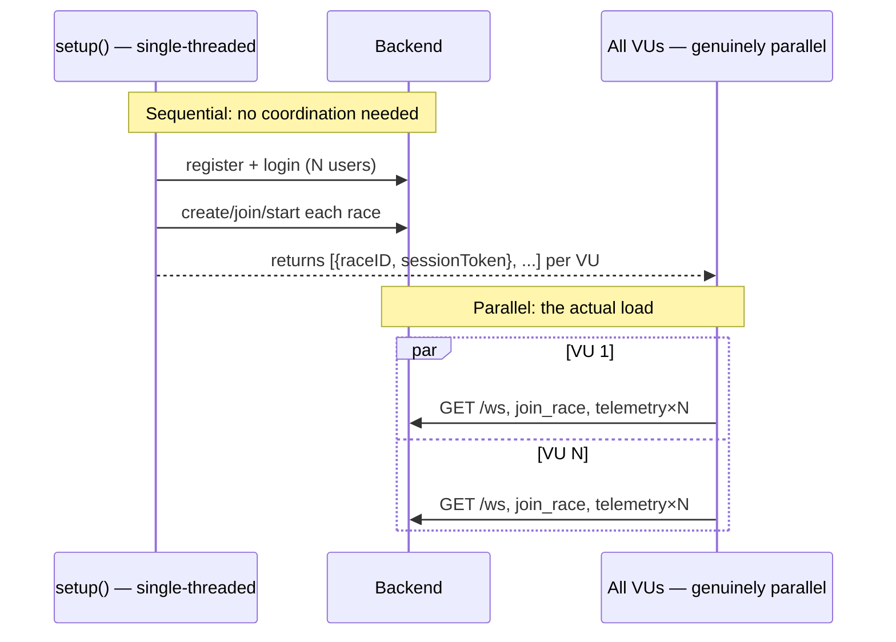

Scale knobs, tunable via `-e` without editing the script:

| Variable | Default | Meaning |
| --- | --- | --- |
| `NUM_RACES` | `5` | Concurrent races |
| `VUS_PER_RACE` | `8` | Participants per race (`<= race.MaxParticipants` = 10) |
| `DISTANCE_METERS` | `30` | Target word count — how long each race lasts |

### How they work together — the diagnostic loop

This is the actual point of building all four: a repeatable loop for turning "something feels slow" into "here's the exact line of code and the fix."

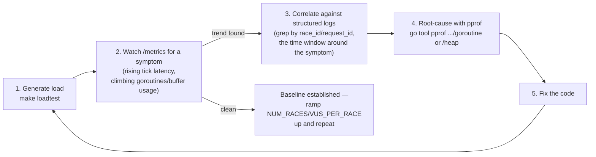

The one signal worth watching most closely at step 2: a gauge (`aviron_rooms_active`, `go_goroutines`) that keeps climbing *after* every VU has disconnected, not just during the run — that's the concrete signature of a leak, as opposed to load.

### Different failure modes surface through different tools first

Not every problem needs the full loop above — a hard failure and a slow degradation look completely different at step 2, and knowing which tool actually caught it first matters:

| Failure mode | First signal | Tool that catches it fastest |
| --- | --- | --- |
| Hard failure (every request/connection rejected outright) | k6's own checks/summary fail immediately | k6's pass/fail output + one structured-log status field |
| Slow degradation under sustained load | A gauge/histogram trending up over the course of one run | `/metrics` |
| Resource leak (never recovers after load stops) | A gauge that stays elevated after every VU has disconnected | `/metrics`, watched before/during/after |
| "Which exact code path is responsible" | N/A — always the follow-up question once one of the above fires | `pprof` |

### Case study: a real bug this actually caught

The first real `k6 run` against a live server got `501 Not Implemented` on every single WebSocket handshake — a hard failure, not a degradation, so it showed up immediately in k6's own output (`ws_session_duration avg=2ms`, sessions closing instantly) rather than needing a metrics trend or a pprof profile to notice. The structured request log confirmed it with one field:

```json
{"time":"2026-07-23T11:09:44+07:00","level":"INFO","msg":"http_request","method":"GET","path":"/ws","status":501,"duration":43250,"request_id":"110cd8f3b11deddeb5e6a952be10cfa0"}
```

Root cause, found by reading the `coder/websocket` library's own source once the symptom pointed squarely at the handshake: `RequestLog`'s `statusWriter` wraps `http.ResponseWriter` to capture the status code, but only embeds the 3-method `http.ResponseWriter` *interface* — not the concrete writer's full method set — so `http.Hijacker` (which a WebSocket upgrade requires, to take over the raw TCP connection) silently stopped being reachable through it. Since `RequestLog` wraps the entire mux, this had been breaking every real WebSocket connection — including real players', not just k6's — since the day Structured Logging shipped, undetected because `internal/ws`'s own tests exercise a fake connection, never a real `net/http` hijack:

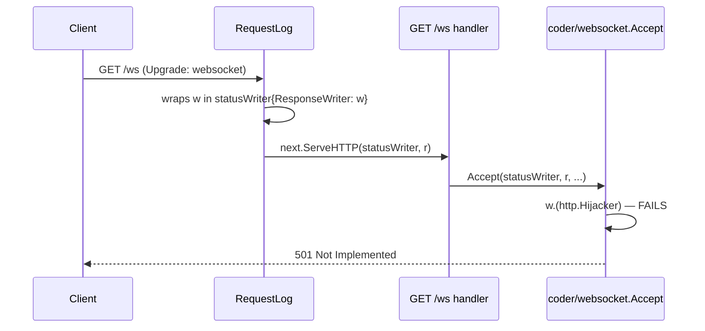

Fixed by giving `statusWriter` its own `Hijack()` forwarding to the underlying writer. This is the honest lesson from building this whole system: pprof and Prometheus are built to answer "why is it slow" or "why is it leaking" — neither would have been the fastest path to a total connection failure. The right tool depended on the *shape* of the failure, not just having every tool available.

## Horizontally Scaling

**Status: implemented** (`redis-room-registry.md` shipped 2026-07-25, `race-router.md` shipped 2026-07-26 — Phase 4's `horizontal-scaling/` sub-area, both ahead of `event-pipeline/` below). This section works through the architecture a real large-scale multiplayer game backend uses, why most of it doesn't fit a project at this scale, and the right-sized version this codebase actually built. `internal/roomlocator` (the registry client), `internal/racerouter` (the routing/reverse-proxy logic, invoked from `cmd/race-router`), and the Redis dependency are all in the code today — this section was originally written as design groundwork ahead of the build; the "Our approach" design below is what actually shipped, not just what was planned.

### The architecture researched for large-scale multiplayer games

Real-world, internet-scale multiplayer game backends (battle royale titles, MMOs) are built around one hard constraint this project doesn't have: a global, geographically distributed player base where connection latency to the nearest server matters as much as correctness does. That constraint produces a specific, layered shape:

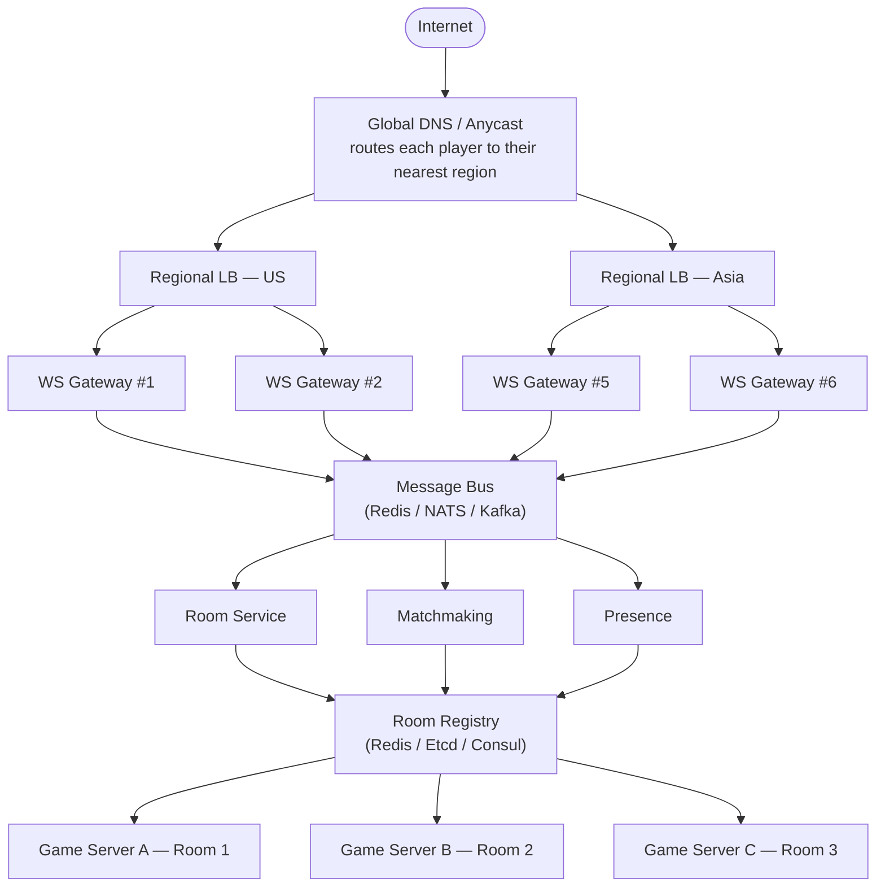

| Component | Role | Why it exists |
| --- | --- | --- |
| Global DNS / Anycast | Routes a player's very first connection to whichever region is topologically closest to them | Minimizes the one latency cost a player feels on every packet for the rest of the session — worth solving once, at the network layer, rather than per-request |
| Regional LB | Spreads a region's connections across that region's pool of WS Gateways | HA and throughput within a region — no single gateway process is a bottleneck or a single point of failure |
| WS Gateway | Terminates the player's actual WebSocket connection; does lightweight auth, then forwards everything onto the message bus | Connection-holding (I/O-bound, scales with player count) and simulation (CPU-bound, scales with active-room count and per-room complexity) have different cost curves at real scale — splitting them lets each scale to its own bottleneck instead of over-provisioning one to satisfy the other |
| Message Bus (Redis/NATS/Kafka) | The transport between every Gateway and every backend service, regardless of which physical machine either side is on | A Gateway never needs to know which Game Server currently owns a given room, or even which region it's in — it just publishes/subscribes by room id and lets the bus deliver |
| Room Service | Tracks a room's lifecycle at the metadata level — which rooms exist, what state they're in | Separate from the Game Server itself so "does this room exist and what's its status" can be answered without touching the process actually running the simulation |
| Matchmaking | Groups players into a room by skill/region/queue rules *before* a room is created | A room-assignment decision that has to happen before there's a room id to route by at all |
| Presence | Tracks who's online/offline/in-a-room platform-wide | Feeds friends lists, invites, and notifications — a cross-cutting concern unrelated to any single room |
| Room Registry (Redis/Etcd/Consul) | The durable, authoritative map of room id → owning Game Server | Lets any Gateway, Room Service, or Matchmaking node discover the correct owner without hardcoding server topology anywhere |
| Game Server | The process actually running one room's simulation tick | One room (or a small number) per server, since real simulation — physics, AI, anti-cheat — is CPU/GPU-heavy enough that a server can only host so many at once |

How it works together, end to end: DNS sends a player to their nearest region → the regional LB picks any healthy Gateway in that region → the Gateway authenticates the connection and, once Matchmaking/Room Service assigns or looks up a room, consults the Room Registry to learn which Game Server owns it → from then on, all of that connection's game traffic flows Gateway ↔ Message Bus ↔ Game Server, with the room's actual state never leaving the Game Server process. Note that only the LB/Gateway tier is regional for latency reasons — the Message Bus and everything behind it (Room Service, Matchmaking, Presence, Room Registry, Game Servers) is one shared pool every region's Gateways reach through the same bus, which is exactly what makes the cross-region join case below possible at all.

Step by step — two players landing on Gateways in **different regions**, joining the **same** room:

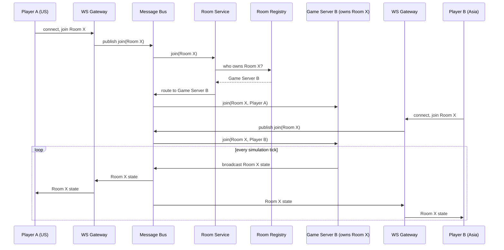

Neither Gateway ever talks to Game Server B directly, and neither player's region matters once the Room Registry has answered "who owns this room" once — every subsequent tick flows through the same Message Bus regardless of where each Gateway physically sits.

### Why not every component fits this project

| Component | Verdict for this project | Reasoning |
| --- | --- | --- |
| Global DNS / Anycast, regional split | **Drop entirely** | Solves cross-continent latency for a worldwide player base. This project has no multi-region requirement — one deployment, one set of users, collapses to nothing. |
| Regional LB | **Simplify to one LB** | Same job, just singular — one load balancer in front of the whole instance pool, not one per region. |
| WS Gateway as a tier separate from the Game Server | **Merge into one tier** | The split only earns its cost when connection-load and simulation-load scale at genuinely different rates. `RoomActor.Run()` here is a `select` loop mutating a small struct and marshaling a JSON snapshot every 250ms — no physics, no AI, nothing CPU-bound. Room count and connection count scale together almost 1:1 (max 10 participants per race), so there's no divergent curve to split apart. Splitting would also mean *every* message pays a message-bus hop, not just the cross-instance case — strictly worse here. |
| Message Bus | **Keep, but in a narrower role** | See "Our approach" below — used for keeping a routing cache warm, not for relaying every in-flight game message. |
| Room Service | **Keep, but merged into the existing tier** | This is exactly `internal/room.RoomActor` + `Registry` — already built, already living inside `race-service` itself, not a separate microservice. |
| Matchmaking | **Drop entirely** | No automatic/skill-based matchmaking exists or is planned — races are manually created, joined by id, or browsed from a list. Nothing in this project's scope needs it. |
| Presence | **Drop entirely** | No cross-room, platform-wide "who's online" feature exists or is planned. Per-room connected/disconnected state is already handled by `RoomActor`'s own `disconnected_at`/`evicted` tracking, which is all this project needs. |
| Room Registry | **Keep — maps directly** | This is `redis-room-registry.md`'s `SET room:<id> instance:<id> NX EX 60` design, already planned for Phase 4. |
| Game Server (dedicated process per room) | **Simplify to a goroutine** | A real game server needs a whole process/container per room because simulation is CPU-heavy. A typing race's room actor is cheap enough that many rooms share one `race-service` process — no per-room server needed. |

### Our approach for this project

Right-sized version: one region, one LB, one merged connection-and-simulation tier, and a Redis registry doing double duty — but the biggest change from what this project's Phase 4 specs originally planned is *how* a client actually reaches the instance that owns their room.

`cross-instance-relay.md` (the existing Phase 4 spec) relays every individual client message through Redis pub/sub for the lifetime of a cross-instance connection — explicitly flagged in that spec as *"the hardest and highest-risk spec in the entire project"*. The design below avoids that entirely: instead of relaying messages after the fact, route the connection to the correct instance **once, up front**, and let everything after that be ordinary local traffic.

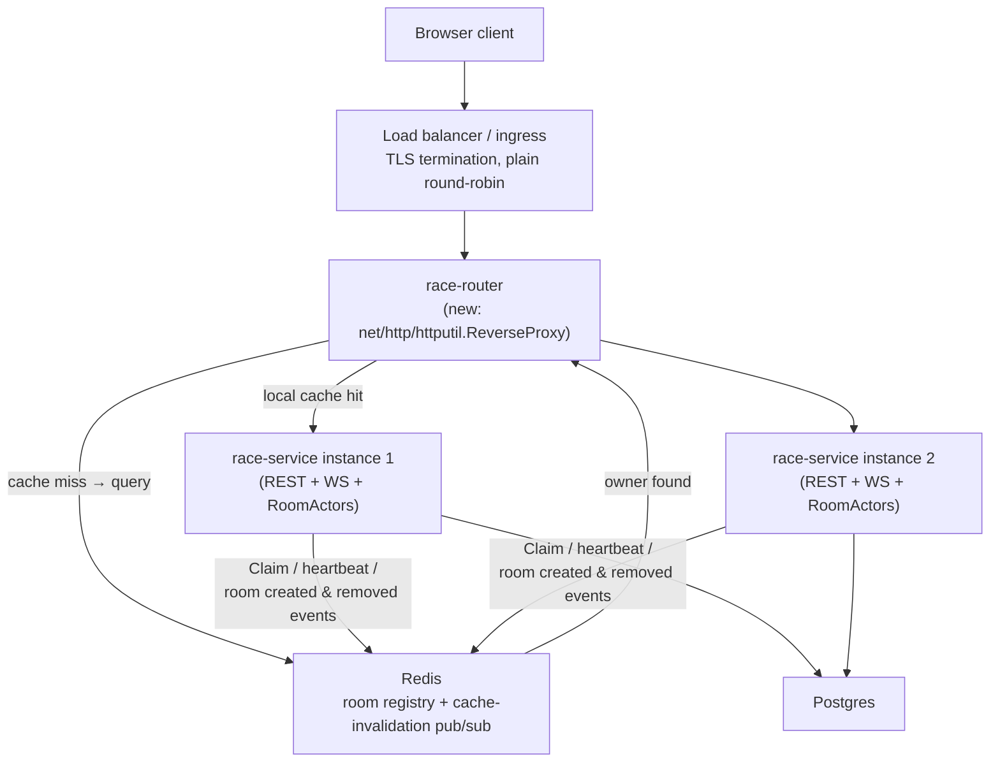

- **Room ownership is still decided by construction**, exactly as today: whichever instance handles `POST /races` becomes the owner and claims it in Redis (`redis-room-registry.md`'s `SET room:<id> instance:<id> NX EX 60`, refreshed on a heartbeat). No hash formula ever decides ownership, so there's no ring-reshuffle-orphans-a-live-room risk to design around in the first place.
- **`race-router` replaces the message relay with a one-time routing decision.** It keeps a local in-memory cache of `race_id → instance`, kept warm by subscribing to Redis pub/sub for room-created/room-removed events, falling back to a direct Redis query on a cache miss. A request with no `race_id` (register/login/browse) skips all of this and goes round-robin to any healthy instance.
- **Once proxied, a connection is 100% local for its entire lifetime** — including the WebSocket's full duration. `internal/room`/`internal/ws` need no relay-awareness at all; `cross-instance-relay.md`'s `Relay.Dispatch`/`SubscribeOut`/eviction-mirroring machinery becomes unnecessary and is superseded by this design, not layered on top of it.
- **Message Bus's role shrinks accordingly**: Redis pub/sub here only carries small, infrequent "room created"/"room removed" notifications to keep `race-router`'s cache warm — not the high-frequency per-tick `race_state` traffic the original relay design would have pushed through it.
- **Graceful draining on scale-down**: an instance being removed is marked not-ready for *new* room placement immediately, but keeps serving rooms it already owns until they finish or a bounded drain timeout elapses (`readinessProbe` + `preStop` + `terminationGracePeriodSeconds` — the same graceful-shutdown principle `project-overview.md` §7 already calls for, just extended from request-length to room-length timescales).
- **Redis itself should run as a Cluster with per-shard replication in a real deployment of this design** — the registry (and `race-router`'s cache-invalidation feed) becoming unavailable stops new joins/reconnects from resolving correctly, and a single node has no automatic failover. **For this project, a single Redis instance is implemented instead, deliberately, for simplicity** — the same category of accepted single-point-of-failure risk this project already carries for its one, non-HA Postgres instance. This is a disclosed scope decision, not an oversight, and the upgrade path (Sentinel or Cluster) is already known if it's ever needed.

### Revision: adopting a WS Gateway tier

**Status: superseding "Our approach for this project" above.** The
project has moved from `race-router` (removed — `cmd/race-router` and
`internal/racerouter` no longer exist) to a genuine WS Gateway + Message
Bus split, the fuller-fidelity pattern this section's own "architecture
researched for large-scale multiplayer games" walked through earlier.
This isn't a correction of that earlier analysis — the "Why not every
component fits this project" table's reasoning still holds: a typing
race's `RoomActor` is a cheap 250ms `select` loop, room count and
connection count still scale together almost 1:1, and nothing about this
project's actual load requires splitting connection-holding from
simulation. This revision overrides that conclusion on purpose instead:
the project is deliberately taking on the harder pattern — per-message
relay over a bus, message ordering across process boundaries,
eviction-mirroring, a connection tier that's never the same process as
the simulation tier — for what it teaches, which is exactly what this
whole project targets (per `project-overview.md` §0/§1). `cross-instance-
relay.md`'s original design (previously written, then explicitly
superseded by `race-router.md` before it was ever built) is the design
being revived here, generalized from "only when a connection lands on
the wrong instance" to "always."

#### What changes, concretely

- New binary `cmd/ws-gateway` (`internal/wsgateway`) replaces
  `cmd/race-router` (`internal/racerouter`).
- **REST traffic is unaffected in spirit.** `ws-gateway` still
  reverse-proxies REST requests using the same design `race-router` had:
  room-scoped requests (`/races/{id}/...`) resolve via the registry's
  `Owner()` lookup (cached, kept warm by the same `room:events`
  subscription) and get proxied to that instance; room-less requests
  (register, login, browse, leaderboard) round-robin across every healthy
  instance.
- **`GET /ws` is the actual pivot.** `ws-gateway` now *terminates* the
  WebSocket itself — does the upgrade, holds the live connection, decodes
  and encodes the JSON protocol frames (`project-overview.md` §4.2)
  itself — instead of proxying the raw connection through to whichever
  `race-service` instance owns the room the way `race-router` did.
- A new **message bus** (package `internal/roomrelay` — the name
  `phase-5-plan.md`'s docs once referenced by mistake, before it
  described anything real; it's real now), running on **NATS Core, not
  Redis pub/sub** — see "## Game Message Bus" below for the comparison
  this choice is based on — carries every decoded frame between
  `ws-gateway` and the owning `race-service` instance: subject
  `room.{race_id}.in` (join/telemetry/leave, Gateway → Room Service) and
  `room.{race_id}.out` (state snapshots, and a `room_closed` signal when
  the room ends, Room Service → Gateway). The room **registry** stays on
  Redis, completely unaffected — this is a transport swap for the
  high-frequency real-time bus specifically, isolating that traffic from
  the registry's own Redis load, not a move off Redis generally.
- `internal/room.RoomActor` keeps its exact single-writer
  event-application logic unchanged (`room-actor-core.md`'s design is
  untouched) — only its I/O plumbing changes: its `inbox` is fed by a
  bus-subscriber goroutine instead of a local WS reader goroutine, and
  its 250ms tick publishes one snapshot onto the bus instead of writing
  to N local per-connection channels.
- The Redis **room registry** (`redis-room-registry.md`'s `SET
  room:<id> instance:<id> NX EX 60`) is unchanged and still required, but
  its job narrows: it's consulted for REST routing and for `race-service`
  ownership claim/refresh/release, never for WebSocket traffic anymore —
  the bus's subject-name addressing (`room.{race_id}.*`) replaces the
  lookup for that path entirely. `ws-gateway` never needs to know *which*
  instance owns a room to relay a WS message to it, only the room's id.

#### Diagram

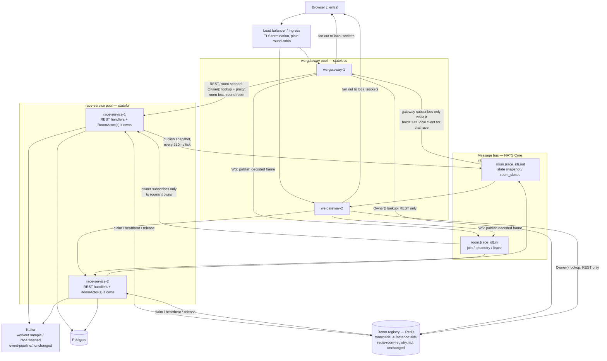

#### What this reintroduces, honestly

Not quite the generic "eviction-mirroring" cost the large-scale research
above describes — this codebase's actual `RoomActor` semantics make the
real shape of the problem narrower than that. `IsEvicted` only ever gates
a *new* connection attempt from someone whose 30s reconnect grace period
already expired (`ParticipantEvicted` only fires after
`ParticipantDisconnected`, never against someone still connected) — there
is no code path in `internal/room` today that force-closes an already-live
socket for a single evicted user. The real thing that *does* force-close
every live socket in a room is room lifecycle end (finished, cancelled,
or otherwise torn down): `internal/ws/hub.go`'s `done`/`hub.closed`
already drains the final `race_state`/`race_finished` broadcast and then
signals every locally-attached connection to close, today, in-process.
Once the connection lives on a different process than the room, that
signal has to cross the bus too — `ws-gateway` needs its own
`user_id -> local connection` bookkeeping per race so it knows which
sockets to close when a `room_closed` message arrives, mirroring what
`hub.go` already does locally. The evicted-reconnect check, by contrast,
doesn't need the bus at all: it's a cheap synchronous lookup `ws-gateway`
can make directly against Redis at connection-attempt time (the same
Redis the registry already uses), not a message relayed through
`room.{race_id}.*`. New specs under `context/features/phase4/horizontal-
scaling/` are where both of these get designed and built for real this
time, not deferred again.

#### Where this leaves the earlier reasoning in this section

The "Why not every component fits this project" table above isn't
wrong, and this revision doesn't invalidate it — a typing race's
`RoomActor` genuinely doesn't need this split to scale at this project's
actual size. `cross-instance-relay.md`'s original verdict, *"the hardest
and highest-risk spec in the entire project,"* still applies too; it's
no longer a reason to avoid building it, only a reason to build it
carefully, with its own dedicated specs and its own dedicated tests.

## Event Pipeline: Kafka → Postgres

**Status: implemented** (`kafka-producer.md`, `kafka-consumer-postgres-sink.md` — Phase 4's `event-pipeline/` sub-area, both shipped 2026-07-26). This section answers a question worth asking explicitly rather than taking on faith: given that Postgres is still where telemetry ends up either way, what does routing it through Kafka first actually buy this project?

### The problem this solves

`RoomActor.applyEvent`'s `TelemetryReceived` case (`internal/room/room.go`) fires once per `telemetry` message a client sends — bounded by human typing speed, roughly every 0.4–2s per player (`project-overview.md` §4.2), but multiplied across every participant in every active room, across however many `race-service` instances Phase 4's horizontal scaling is running at once. That's a continuous, fan-in write workload with no natural batching unless something batches it, and it's arriving at exactly the place in this codebase that's least allowed to stall: `RoomActor.Run()`'s single-writer `select` loop, which also owns the room's 250ms broadcast tick (`room-actor-core.md`'s own single-writer principle — one blocked event delays every other event queued behind it in that room's `inbox`).

Two options if telemetry went straight to Postgres instead:

- **A synchronous `INSERT` per telemetry event, called directly from `applyEvent`.** The room actor's hot path would now pay a full network round trip plus a Postgres write on every keystroke any player sends, for a row that isn't even on the critical path of "keep connected clients in sync" — that's the broadcast tick, not row-level telemetry history.
- **Each room actor batches in memory itself before writing.** Now every room actor — and there can be many, per instance, across however many instances — needs its own flush-timer machinery, all independently contending for the same Postgres connection pool at flush time, duplicated N times instead of built once.

Kafka is the answer `project-overview.md` §6 already chose; the rest of this section is why that choice actually pays off, concretely, in this codebase.

### Architecture

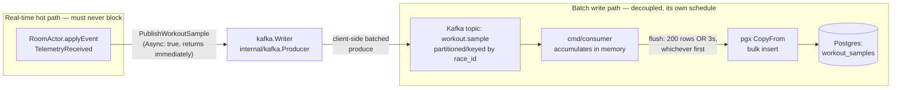

### Why Kafka instead of a direct Postgres write helps this project scale

**It decouples the real-time hot path from Postgres's write throughput.** `PublishWorkoutSample` (`internal/kafka/producer.go`) is fire-and-forget: the underlying `kafka.Writer` is constructed with `Async: true`, so `WriteMessages` hands the message to an in-memory client-side buffer and returns immediately — it does not wait for the broker to actually persist or acknowledge it, let alone for Postgres to do anything. Because of that, this project can run many `race-service` instances at once (`server-a`, `server-b`, ... — Phase 4's horizontal scaling), each running any number of room actors, and *none of them ever contends directly with Postgres for a telemetry write*. That write pressure lands on Kafka instead — a system built specifically to absorb many concurrent producers cheaply as an append-only log.

The actual database write happens in exactly one place: `cmd/consumer`, batching up to 200 rows or 3 seconds' worth (whichever comes first) into a single `pgx.CopyFrom` bulk insert. Postgres ends up seeing a small, steady stream of large batch writes instead of a large, bursty stream of tiny individual ones scaling directly with `instances × rooms per instance × players per room`. And per §6's own reasoning ("a dedicated Go consumer group... so consumers can scale independently"): if telemetry volume ever outgrows one consumer, the fix is scaling the *consumer* side — more members in the same consumer group, more partitions — entirely independent of the real-time room-actor/WebSocket tier. Those two halves of the system have genuinely different scaling profiles (I/O-bound real-time fan-out vs. batch database write throughput), the same reasoning the "Horizontally Scaling" section above uses to justify splitting a WS Gateway from a Game Server — applied here to the write path instead of the connection path.

**This reasoning applies to `workout.sample` specifically, not `race.finished`.** `race.finished` stays a low-frequency event (one per race, not one per keystroke) whose correctness matters immediately, so it's never put through this batching/decoupling logic at all — `RaceService.FinishRace` still writes `races`/`race_participants`/`leaderboard_alltime` synchronously and transactionally, and `PublishRaceFinished` only fires *after* that write already succeeded. The Kafka consumer's own handling of `race.finished` is a narrow, idempotent reconciliation safety net (`ReconcileParticipantResults`, `WHERE finish_rank IS NULL`) for the rare case that synchronous write didn't happen — not a second primary writer, and not something this scaling argument is about. See `kafka-consumer-postgres-sink.md`'s own Overview for why that split isn't a dual-write hazard.

### Why a Kafka publish is mechanically cheaper than a Postgres `INSERT`

This is a separate claim from the async/non-blocking point above, and worth pulling apart from it: even ignoring that `PublishWorkoutSample` doesn't wait around, the unit of work Kafka eventually does per message is cheaper in kind than what Postgres does per row.

| | A Postgres `INSERT` (what `workout_samples` would need directly) | A Kafka partition append (what actually happens first) |
| --- | --- | --- |
| Parsing/planning | Full SQL parse + query plan | None — no query language involved |
| Constraints | Two foreign keys checked (`race_id → races.id`, `user_id → users.id`) | None |
| Durability | Write-ahead log record, then apply to the table and its indexes, then `fsync` (governed by `synchronous_commit`) | Sequential append to the end of a partition's log file |
| Indexing | `idx_workout_samples_race_user_ts` maintained on every insert | No index to maintain on write |
| Concurrency control | MVCC bookkeeping, row/page locking | None — an append-only log has no in-place updates to guard |

None of this replaces the eventual Postgres write — it still happens, via `CopyFrom`, and every row still lands in `workout_samples`. What Kafka buys is *reshaping* that write: instead of `N` small transactional inserts issued directly and concurrently from `N` room-actor goroutines (scaling with instance count × room count × player count), it becomes **one** large, efficient batch insert, issued by **one** process, on its own schedule, fully decoupled from the exact millisecond any specific player typed a specific word. `kafka-go`'s own `Writer` batches client-side before it ever talks to the broker too — the same "batch, don't do it one row at a time" principle `project-overview.md` §3 asks for at the database layer, just applied one hop earlier in the pipeline.

## Game Message Bus

### Summary

| Feature | Redis Pub/Sub | NATS Core | Kafka |
| --- | --- | --- | --- |
| Primary purpose | Cache with Pub/Sub | Low-latency messaging | Event streaming |
| Latency | Very low | Very low | Low, but higher than NATS/Redis |
| Message persistence | No | No (JetStream: Yes) | Yes |
| Replay | No | JetStream only | Yes |
| Queue / Load balancing | No | Yes (Queue Groups) | Yes (Consumer Groups) |
| Wildcard routing | Limited | Excellent | Limited (Topic/Partition model) |
| Best for | Small systems | Realtime communication | Durable event pipelines |

### Redis Pub/Sub

**Pros**

- Extremely simple to deploy.
- Very low latency.
- A good choice for prototypes or small multiplayer games.
- Often already exists in the stack for cache, sessions, and presence.

**Cons**

- Pub/Sub is an additional feature, not Redis' primary purpose.
- No built-in load balancing between consumers.
- No persistence or replay.
- Limited routing capabilities.
- Can become a bottleneck as the number of channels and subscribers grows.

**Recommendation**

Suitable for:

- Small to medium multiplayer games.
- MVPs where operational simplicity is more important than scalability.

---

### NATS

**Pros**

- Designed specifically as a messaging system.
- Extremely low latency and high throughput.
- Subject-based routing with wildcard subscriptions.
- Built-in Queue Groups for horizontal scaling.
- Native request/reply support.
- Excellent fit for microservices and realtime systems.

**Cons**

- Core NATS does not persist messages.
- Introduces another infrastructure component if Redis is already deployed.

**Recommendation**

Best choice for realtime game traffic:

- Gateway ↔ Game Server
- Game Server ↔ Game Server
- Matchmaking
- Presence
- Chat
- Any latency-sensitive communication

JetStream can be added later if selective persistence is required.

---

### Kafka

**Pros**

- Durable storage.
- Replayable event log.
- Excellent scalability.
- Consumer Groups provide parallel processing.
- Ideal for analytics and event-driven architectures.

**Cons**

- Higher latency than NATS.
- Every message is treated as durable data.
- Not optimized for short-lived, high-frequency game packets (e.g. movement updates).
- More operational complexity.

**Recommendation**

Excellent for backend event processing:

- Match results
- Analytics
- Leaderboards
- Anti-cheat
- Auditing
- Event sourcing

Not recommended as the primary message bus for realtime gameplay.

---

### Redis Pub/Sub vs NATS

Both Redis Pub/Sub and NATS are suitable for realtime messaging, but they target different use cases.

| Aspect | Redis Pub/Sub | NATS |
| --- | --- | --- |
| Design goal | Cache with messaging capability | Dedicated messaging system |
| Routing | Channels | Subjects with wildcard routing |
| Load balancing | No | Yes (Queue Groups) |
| Request/Reply | Manual | Built-in |
| Horizontal scaling | Good | Excellent |
| Operational complexity | Very low | Low |

The biggest difference is that **NATS is designed to route messages**, while **Redis is designed to store data**.

For example, routing messages by room:

```text
Redis

Publish -> room.123

Subscribers:
- room.123
```

NATS supports hierarchical subjects:

```text
room.123.move
room.123.chat
room.456.move
```

A subscriber can receive:

```text
room.123.*
```

or even

```text
room.>
```

which is useful when handling thousands of game rooms.

Another important feature is **Queue Groups**.

Suppose three Game Server workers process matchmaking requests.

Redis Pub/Sub:

```text
Publish "matchmaking"

        │
        ▼
 ┌──────┼──────┐
 ▼      ▼      ▼
GS1    GS2    GS3
```

Every subscriber receives the message.

NATS Queue Group:

```text
Publish "matchmaking"

        │
        ▼
   Queue Group
        │
        ▼
   One available worker
```

Only one worker processes the request, making horizontal scaling straightforward.

**Recommendation**

- Redis Pub/Sub is sufficient for prototypes and small games.
- NATS is generally the better choice for production realtime communication.

---

### Redis Pub/Sub vs Kafka

These systems solve fundamentally different problems.

| Aspect | Redis Pub/Sub | Kafka |
| --- | --- | --- |
| Purpose | Live message delivery | Durable event streaming |
| Persistence | No | Yes |
| Replay | No | Yes |
| Consumer offline | Message lost | Consumer reads later |
| Latency | Very low | Low, but higher |
| Best suited for | Live gameplay | Business events |

Consider player movement.

```text
Player
Move(100,100)
Move(101,100)
Move(102,100)
...
Move(160,100)
```

For gameplay, only the latest state matters.

Redis immediately forwards each update:

```text
Gateway
    │
    ▼
Redis Pub/Sub
    │
    ▼
Game Server
```

If one update is lost, the next update replaces it.

Kafka behaves differently.

```text
Offset 1001  Move(100,100)
Offset 1002  Move(101,100)
Offset 1003  Move(102,100)
...
```

Every event is appended to the log and can be replayed later.

This is valuable for:

- analytics
- auditing
- replay
- event sourcing

but unnecessary for high-frequency gameplay traffic.

**Recommendation**

- Redis Pub/Sub is better for transient realtime updates.
- Kafka is better for durable business events.

---

### NATS vs Kafka

Although both are messaging systems, they are optimized for different workloads.

| Aspect | NATS | Kafka |
| --- | --- | --- |
| Primary goal | Low-latency messaging | Durable event streaming |
| Persistence | Optional (JetStream) | Built-in |
| Replay | Optional | Core feature |
| Routing | Subjects | Topics + Partitions |
| Request/Reply | Native | Not supported |
| Typical latency | Very low | Higher |
| Best suited for | Realtime systems | Data pipelines |

The design philosophy is different.

NATS forwards messages immediately.

```text
Publisher
    │
    ▼
 NATS
    │
    ▼
Subscriber
```

Kafka stores every message before consumers process it.

```text
Producer
    │
    ▼
 Kafka Log
    │
    ▼
Consumer
```

For gameplay, replaying old packets is usually meaningless.

For example, if a Game Server pauses for 100 ms, hundreds of movement packets may accumulate.

Kafka expects consumers to process every packet in order.

NATS focuses on delivering messages with minimal latency, which better matches realtime game loops.

Kafka excels when every event is important:

- Match finished
- Item purchased
- Achievement unlocked
- Tournament completed

These events have long-term business value and often need to be replayed by multiple downstream systems.

**Recommendation**

- NATS for realtime communication.
- Kafka for durable event processing.

---

### Recommendation for Multiplayer Games

```text
                   Player
                      │
                 WebSocket
                      │
                 WS Gateway
                      │
                      ▼
              NATS / Redis Pub/Sub
                      │
                 Game Server
                      │
          ┌───────────┴────────────┐
          │                        │
          ▼                        ▼
     Game State              Match Result
 (realtime events)          (persistent events)
          │                        │
          │                    Kafka
          │                        │
          │          ┌─────────────┼─────────────┐
          │          ▼             ▼             ▼
          │      Analytics     Database     Anti-cheat
          │
      Players
```

| Use case | Recommended |
| --- | --- |
| Player movement, combat, state updates | **NATS** |
| Small projects / MVP | **Redis Pub/Sub** |
| Match history, analytics, persistent events | **Kafka** |

A common production architecture combines all three:

- **NATS** for realtime gameplay messaging.
- **Redis** for cache, sessions, presence, and room registry.
- **Kafka** for durable business events and analytics.

## Graceful Shutdown

**Status: implemented** (`graceful-shutdown.md` — Phase 5's second spec, shipped 2026-07-29, verified live against all three binaries, not just unit-tested).

### Why this was needed

Before this spec, none of `cmd/server`, `cmd/ws-gateway`, or `cmd/consumer` handled `SIGTERM` at all — confirmed by reading every `run.go` directly, and `cmd/ws-gateway/run.go` said so in its own comment. A process receiving it just died, exactly as abruptly as `SIGKILL` would, just a few seconds sooner. Concretely:

- A race in progress on `cmd/server` gets cut off mid-flight — `finishRace`'s Postgres transaction never runs, so that race's results are lost, not delayed.
- A WebSocket client connected through `cmd/ws-gateway` sees its connection silently drop (a raw TCP reset), not a clean close.
- `cmd/consumer` could be killed mid-batch — the least risky of the three, since its fetch loops were already written defensively, but still untested against a real cancellation.

This matters specifically because of how Kubernetes tears down a pod: it sends `SIGTERM` first, waits up to `terminationGracePeriodSeconds` (30s default), *then* sends `SIGKILL` if the process hasn't exited on its own. Without handling the first signal, that whole window goes to waste — the process dies instantly instead of using it to wind down cleanly. `project-overview.md` §7 names the cost directly: a pod "must close its active room actors properly, without cutting off the WebSocket of someone mid-race."

### Who triggers it, and how

| Trigger | Fires from | Caught by |
| --- | --- | --- |
| Rolling update, `kubectl rollout restart` | kubelet, on the node the pod is scheduled to | Same code path in all three binaries |
| Scaling down replicas | kubelet | Same |
| Node drain / eviction | kubelet | Same |
| `kubectl delete pod` | kubelet | Same |
| `Ctrl+C` / `kill -TERM <pid>` (local dev) | The shell / operator directly | Same |

Every binary catches both `SIGTERM` and `SIGINT` identically, via one line repeated in each `run.go`:

```go
ctx, stop := signal.NotifyContext(context.Background(), syscall.SIGTERM, syscall.SIGINT)
defer stop()
```

`SIGKILL` is never in that list — it can't be, by OS design, no process can catch it. It's the unconditional backstop if graceful shutdown doesn't finish inside the grace period.

### Three binaries, three different amounts of work

| Binary | What already existed | What this spec actually added |
| --- | --- | --- |
| `cmd/consumer` | Fetch loops (`workout_sample_loop.go`, `race_finished_loop.go`) already checked `ctx.Err()` every iteration and flushed in-flight batches before returning — built defensively, just never exercised | One line: wire the signal-derived context into `c.Run(ctx)` instead of `context.Background()` |
| `cmd/server` | Nothing | Explicit `*http.Server` + `Shutdown`, a `ReadinessGate` (`GET /healthz` vs. new `GET /livez`), and `waitForRoomsToDrain` — a real product decision, not just plumbing |
| `cmd/ws-gateway` | Nothing | Same `Shutdown`/`ReadinessGate` pattern, plus a genuinely new `raceHubRegistry.Shutdown()` — nothing before this could force-disconnect a locally-held connection at all |

### Flow: `cmd/server`

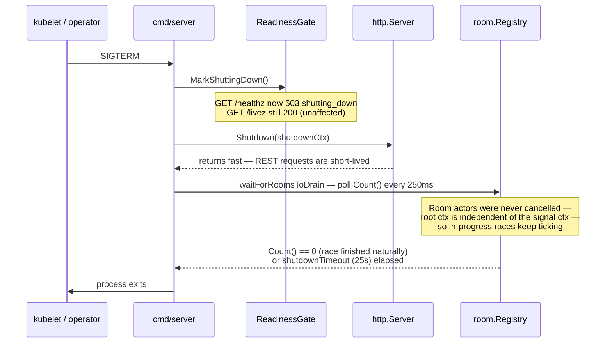

The one line that makes "let races finish naturally" actually true, not just a comment: `main.go` calls `Run(cfg)` and returns — the process exits the instant `Run` returns, regardless of any goroutine still running in the background. Without `waitForRoomsToDrain` explicitly blocking on `registry.Count()`, the room actors' own goroutines would simply get killed the moment the process exited, making the whole design a no-op.

**Verified live**, not just designed: starting a race, then sending `SIGTERM` mid-race, produced this real log sequence —

```json
{"msg":"shutdown signal received, marking unready"}
{"msg":"waiting for in-progress races to finish","active_rooms":1}
{"msg":"roombus: published","kind":"broadcast"}   // ~10 more ticks, over ~2.5s
{"msg":"roombus: published","kind":"room_closed"}
{"msg":"shutdown complete"}
```

The room kept broadcasting for roughly 2.5 more seconds after the signal arrived, and the process only exited once the race reached its own natural end — not force-cancelled the instant `SIGTERM` landed.

### Flow: `cmd/ws-gateway`

The harder case, since this is the binary actually holding live client connections:

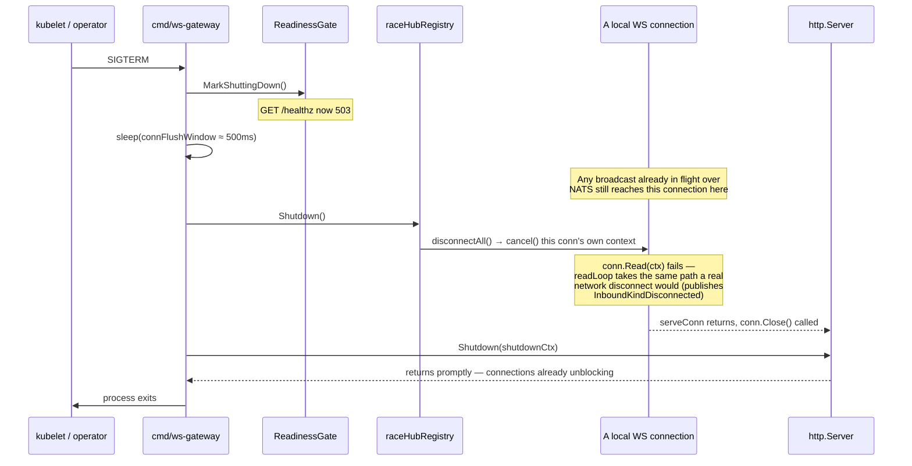

The one deliberate design choice worth calling out: `hubs.Shutdown()` cancels each connection's **own** context, not `hub.closed` (the signal used when a room actually finishes). That distinction matters semantically — the room hasn't ended here, this gateway is just going away, so its participants should go through the *same* grace-period/reconnect handling a real network drop would trigger, not be told "the race is over."

**Verified live**: connected a real WebSocket client, sent `SIGTERM` to the gateway ~0.8s later —

```json
{"msg":"shutdown signal received, marking unready"}   // 15:46:25.199839
{"msg":"wsgateway: received","kind":"broadcast"}        // 15:46:25.222544 — still flowing
{"msg":"wsgateway: received","kind":"broadcast"}        // 15:46:25.474089 — flush window
{"msg":"shutdown complete"}                              // 15:46:25.702053
```

Total: 502ms from signal to clean exit — matching `connFlushWindow` (500ms) almost exactly, not the 25s budget — and the client's own read loop ended with a clean close at the same instant, not a hang.

### Flow: `cmd/consumer`

```mermaid
sequenceDiagram
    participant K8s as kubelet / operator
    participant Con as cmd/consumer
    participant Loop as fetch loop (workout_sample / race_finished)

    K8s->>Con: SIGTERM
    Con->>Loop: ctx cancelled (same signal-derived context, passed straight into c.Run(ctx))
    Loop->>Loop: ctx.Err() != nil on next iteration
    Loop->>Loop: flush in-flight batch (context.Background(), not the cancelled ctx —<br/>so the flush itself isn't cut off)
    Loop-->>Con: returns
    Con->>K8s: process exits — no draining wait needed
```

No per-connection state to drain here, unlike the other two — the fetch loops' own defensive `ctx.Err()` checks (already in place before this spec, just never wired to anything cancellable) do all the real work.

### The core design decision: let races finish naturally

`cmd/server`'s choice — flip readiness immediately, but never cancel the room actors' own root context — is a real, disclosed product tradeoff, not the only option. The alternative (cancel that context too, the instant `SIGTERM` arrives) would force-end every in-progress race the moment a rolling update starts, which reads as a worse outcome given `project-overview.md` §7's own wording. It's bounded, not unbounded: `waitForRoomsToDrain` still respects the same `shutdownTimeout` (25s) `http.Server.Shutdown` uses, and if a room genuinely outlives that budget, Kubernetes' own `SIGKILL` after `terminationGracePeriodSeconds` is the backstop — the same category of accepted, bounded-impact limitation already disclosed for an owning instance crashing outright (a room's live state exists only in that one pod's RAM; no snapshotting or reassignment exists or is planned).

This decision is expected to hold up under a *graceful* rolling update — `multi-instance-k8s-verification.md` (Phase 5, spec 6/6) is where that gets proven against a real `kubectl rollout restart`, not just a locally-sent signal. If it doesn't hold up there, the convention this project already follows applies: fix the design and update `graceful-shutdown.md`'s file, don't just patch around it.

## Dynamic Backend Discovery

**Status: implemented** (`dynamic-backend-discovery.md`, Phase 4's `horizontal-scaling/` sub-area — built after Phase 5's Kubernetes work, closing an open question `ws-gateway.md`'s own Notes had left twice). This section is a from-first-principles walkthrough of *how* it actually works under the hood — not just what was built, but the Kubernetes mechanics that make it possible, since that's genuinely useful to understand on its own.

### The problem this solves

`ws-gateway`'s room-less REST routing (register, login, `POST /races`, `GET /races`, `/leaderboard/*` — anything with no `race_id` in the path) used to round-robin across a fixed list read once from `RACE_SERVICE_INSTANCES` at process startup. Scaling `race-service` — by hand, or later by an `HorizontalPodAutoscaler` (`k8s-hpa.md`) — never updated that list, so a scaled-down pod would stay in rotation forever (requests routed to a dead address) and a scaled-up pod would never receive any room-less traffic at all.

Room-*scoped* routing (`/races/{id}/...`) never had this problem — it already resolves the owning pod's address live, on every request, via a Redis lookup (`roomlocator.Owner`). The fix for the round-robin path is conceptually the same idea, applied with a different tool: **stop reading a static list, start asking something that always knows the live answer.** For room-scoped routing, that "something" is Redis. For the round-robin pool, it's Kubernetes itself — specifically, the `EndpointSlice` objects Kubernetes already maintains for every `Service`.

### How a pod learns who it is: the ServiceAccount token volume

Every pod gets a small, read-only volume auto-mounted by `kubelet` at `/var/run/secrets/kubernetes.io/serviceaccount/`, populated once at pod startup from data the API server already had the moment the `Pod` object was created — not a shared, cluster-wide file, and not something any pod ever writes to:

| File | Contents | Used for | Changes during the pod's life? |
| --- | --- | --- | --- |
| `token` | A JWT identifying this pod's `ServiceAccount` | Authenticating every API request this pod makes | Yes — `kubelet` rotates it periodically before it expires, transparently |
| `ca.crt` | The cluster's own CA certificate | Verifying the API server's TLS certificate | No |
| `namespace` | Plain text, e.g. `aviron` | Scoping API queries (like the `EndpointSlice` watch below) to the right namespace | No — a pod's namespace is fixed for its whole lifetime |

`rest.InClusterConfig()` (`k8s.io/client-go/rest`) reads `token` and `ca.crt` from here, plus the `KUBERNETES_SERVICE_HOST`/`KUBERNETES_SERVICE_PORT` env vars `kubelet` also injects into every pod, to build a ready-to-use client configuration — no manifest wiring needed for any of it. `cmd/ws-gateway/run.go` reads `namespace` itself, directly, since that value isn't part of what `InClusterConfig` returns but the informer below still needs it.

### The request that actually reaches Kubernetes

Building the discovery client is a handful of local steps; only one part of it ever leaves the pod:

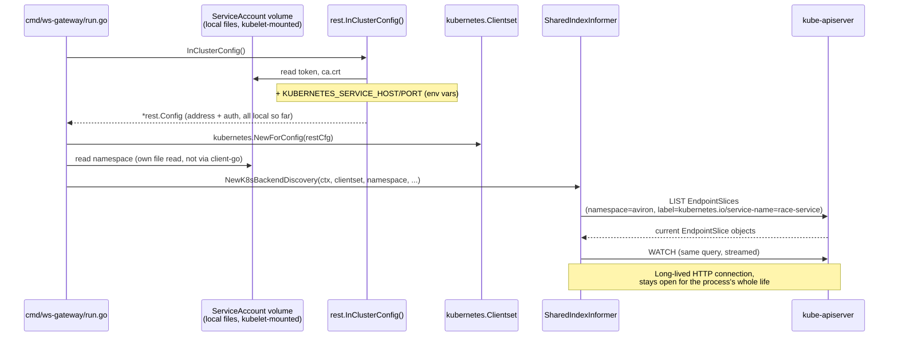

Everything before the first `LIST` call is local file/env reads — no network involved. The `LIST` and the `WATCH` that follows it are the only two things this whole mechanism ever sends over the wire, and the pod only ever talks to the API server (`kube-apiserver`) — never to etcd directly. That's true for every workload in a cluster, not just this one: etcd is the API server's own private datastore, and the API server is the sole gatekeeper in front of it.

### Who's actually keeping that data current

`ws-gateway` never computes "which `race-service` pods are alive" itself — it only *reads* data a built-in Kubernetes controller already maintains, the same data `kube-proxy` reads to program its own routing rules:

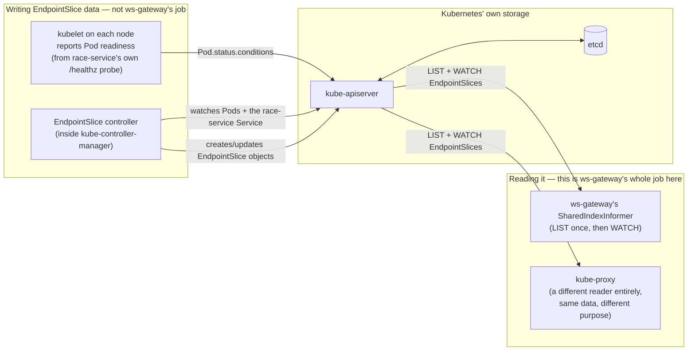

Concretely: `race-service`'s own `readinessProbe` (`GET /healthz`, `k8s-race-service-deploy.md`) is what ultimately drives the `Ready` condition on each `EndpointSlice` entry — `kubelet` reports probe results back to the API server, the `EndpointSlice` controller reflects that into the `Endpoint.Conditions.Ready` field, and `ws-gateway`'s informer sees it change a moment later. This is why `dynamic-backend-discovery.md`'s readiness filtering (below) is really just *trusting* a signal Kubernetes was already producing, not inventing a second one.

### From "the store updated" to "a request gets routed"

Two clearly separate speeds are worth telling apart: the informer's background sync (network-bound, happens whenever Kubernetes says something changed) and a request being routed (must be fast, every time, with zero network calls of its own):

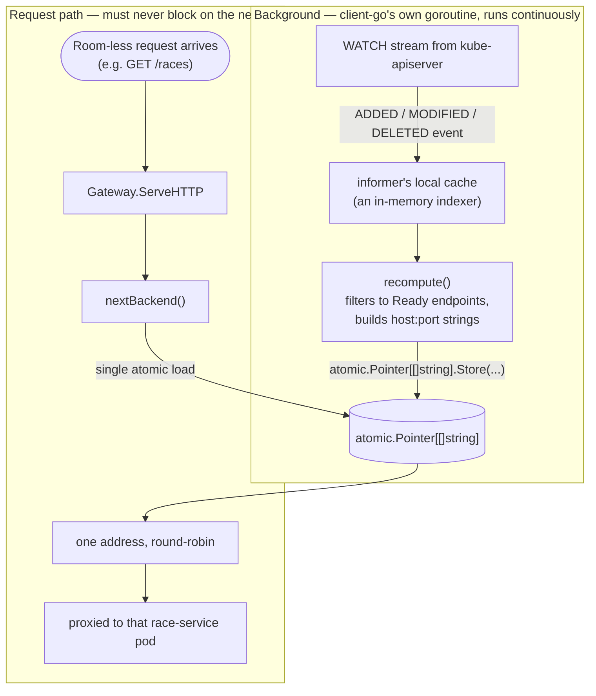

The two halves only ever touch through that one `atomic.Pointer[[]string]` — a request never waits on `kube-apiserver`, and the background sync never blocks on a request being handled. This is the same "no lock needed on the read path" property the old, fully-static `[]string` field had; the pointer swap just makes the value itself capable of changing.

### Why this design, specifically

- **`SharedIndexInformer`, not a hand-rolled `Watch()` loop.** A raw `Watch()` call silently stops seeing updates if the connection drops, unless the caller handles `resourceVersion` expiry and relists by hand — `client-go`'s informer does List-then-Watch, periodic resync, and relist-on-error internally, the same machinery every real Kubernetes controller (including `kube-proxy` in the diagram above) already relies on.
- **A `Role`, not a `ClusterRole`.** `ws-gateway` only ever needs to read one resource type (`endpointslices`) in one namespace (`aviron`) — granting anything broader would be more access than the mechanism actually uses.
- **No new env var to pick discovery mode.** Whether `rest.InClusterConfig()` succeeds already tells `cmd/ws-gateway/run.go` everything it needs: succeeds → real cluster → dynamic discovery; fails with `rest.ErrNotInCluster` → local `go run`/`docker-compose` → fall back to the original static `RACE_SERVICE_INSTANCES` list, unchanged.
- **Readiness is gated on the informer's own first sync**, not assumed instant — `GET /healthz` fails until the informer's initial `LIST` has actually completed, so a freshly-started `ws-gateway` pod can't pass its own readiness probe and then immediately 503 every room-less request against an empty backend pool.
- **Why not a second registry (etcd, Consul, ZooKeeper) instead of Kubernetes' own API**: Kubernetes already runs its own etcd as the backing store for exactly this data. Standing up a second, independent registry would mean a second source of truth that could itself drift from what's actually running — strictly more infrastructure to solve a problem Kubernetes' own API already solves for free.
