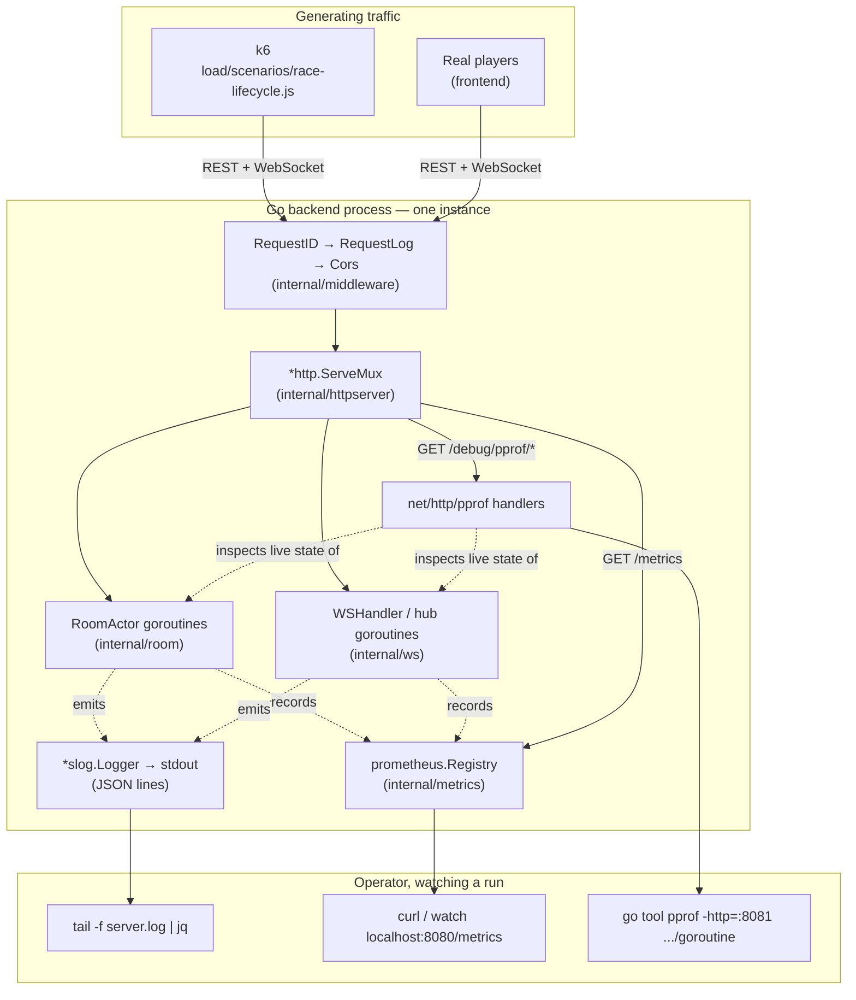
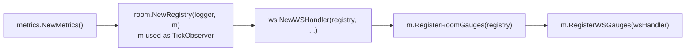
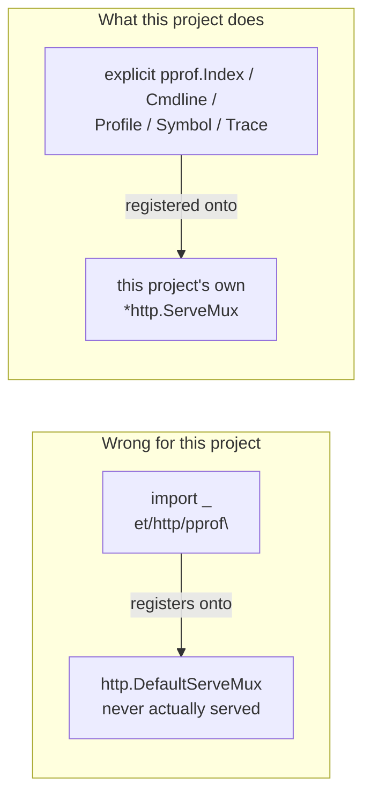
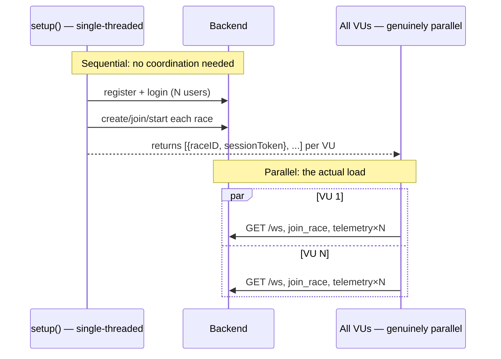
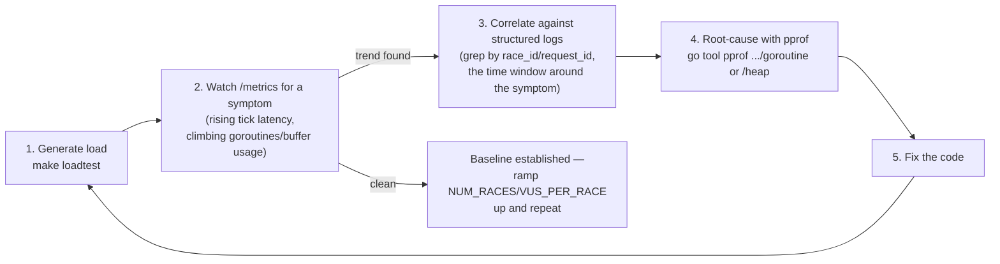
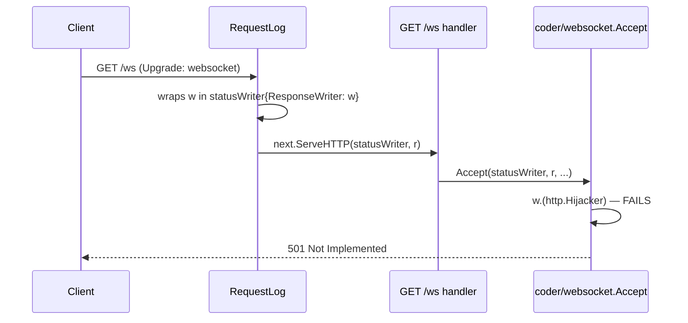

# Knowledge Summary

Architectural reference for this project, organized by phase rather than by individual commit — see `docs/feature-log.md` for the chronological, per-feature history.

## Phase 3: Observability

### The problem this phase solves

A single-instance Go backend with goroutine-per-room and goroutine-per-connection concurrency (Phase 2) can fail in ways that are basically invisible from reading the code: a goroutine leak that only shows up after thousands of connect/disconnect cycles, a channel that starts backing up only once enough rooms are active at once, a broadcast tick that quietly gets slower as the room count grows. None of that is reproducible by staring at source — it only exists *at runtime, under load*. Phase 3 built the tooling to see it when it happens, and Phase 3's own load-testing step is what actually produced load worth watching.

Four pieces, each answering a different question:

| Component | Type | Question it answers | Where the data lives |
| --- | --- | --- | --- |
| Structured logging (`slog`) | Event stream | "What happened, in what order, for this one request/race/connection?" | stdout, one JSON object per line — not persisted anywhere by this project |
| Prometheus metrics (`GET /metrics`) | Aggregate numbers over time | "Is something trending wrong, right now, in aggregate?" | In-process counters/gauges/histograms, scraped on demand — no time-series database deployed |
| pprof (`GET /debug/pprof/*`) | Point-in-time runtime snapshot | "Exactly which goroutine / code path / allocation is responsible?" | Captured live from the Go runtime at request time, never stored |
| k6 (`load/`) | Load generator | "Is there enough realistic concurrent traffic to make any of the above show something?" | External process; its own pass/fail summary at the end of a run |

This maps onto the classic "three pillars of observability" (logs, metrics, traces) with a deliberate substitution: this project has logs and metrics, but no distributed tracing (`opentelemetry-tracing.md` is listed as optional in `context/project-overview.md` §9 and was never built — a single-instance backend has no cross-service request to trace yet). In its place, **pprof** fills the "what exactly is happening inside the process right now" role that tracing would normally help with in a multi-service system. k6 isn't an observability tool at all — it's the load generator that makes the other three worth having; without genuinely concurrent traffic, logs/metrics/pprof have nothing interesting to show.

### Architecture — the whole picture

Every observability surface lives inside the same Go process (`cmd/server`) as the application itself — there's no separate collector, no sidecar, no external log/metrics store. Two different audiences read the process's output: real players (over REST/WebSocket, the actual product), and an operator running a load test who reads logs, metrics, and profiles directly.



### Why this design, specifically

- **No Prometheus server, no Grafana.** `GET /metrics` exists, but nothing scrapes or stores it over time — an operator reads it directly (`curl`, `watch`) during a run. Standing up a real Prometheus+Grafana stack is real infrastructure work with no payoff yet: this is a single instance, there's no fleet to aggregate across, and no on-call rotation to alert. That becomes worth it once Phase 4's horizontal scaling (≥2 instances, Redis-backed room ownership) makes "which instance is unhealthy" a real question — right now there's only one instance to ever be unhealthy.
- **No centralized log aggregation.** Structured JSON to stdout is enough at this scale — `tail -f | jq` or grepping `server.log` covers everything a real aggregator (Loki, ELK) would add, without another moving piece to run locally.
- **pprof is gated behind an env var (`PPROF_ENABLED`, default `true`), not always-on unconditionally.** It's unauthenticated (no JWT concept applies to an operator tool), so a hypothetical real deployment needs the option to turn it off or put it behind network-level access control — the gate exists so that's a config flip, not a code change, when that day comes.
- **Every custom Prometheus metric is prefixed `aviron_`** and none carry a `race_id`/`user_id` label — Prometheus accumulates one permanent label value per distinct value ever seen, so a per-race label would mean unbounded cardinality growth for as long as the process runs. Deliberately avoided, not discovered by accident later.
- **k6 over a hand-written Go load client** — native WebSocket support, and a REST-setup-then-WS-session flow is exactly its intended shape; using it avoids maintaining a second load-generation codebase alongside the real backend.

### Component 1: Structured logging

Every log line is a single JSON object, tagged with up to three correlation IDs, so one request's or one room's story can be reconstructed from the log stream alone:

| Tag | Scopes a line to | Where it comes from |
| --- | --- | --- |
| `request_id` | One HTTP request | `middleware.RequestID()`, `crypto/rand`-generated, echoed back as `X-Request-ID` |
| `race_id` | One race room | A child logger (`logger.With(...)`), tagged once when the room actor is spawned |
| `user_id` | One authenticated caller | `middleware.Auth`, or a WebSocket connection's own child logger |

The middleware chain, outermost to innermost — `RequestID` runs first so even a request that fails auth or CORS still gets an id:


`RoomActor` and `WSHandler` don't repeat `race_id`/`user_id` at every call site — each is handed a logger pre-tagged once, at construction:

```go
// internal/room/registry.go — Registry.Spawn
roomLogger := reg.logger.With(slog.String("race_id", raceID))
actor := NewRoomActor(ctx, raceID, distanceMeters, ..., roomLogger, ...)
```

A real captured log line (`GET /races/.../join`, authenticated):

```json
{"time":"2026-07-23T14:02:11+07:00","level":"INFO","msg":"http_request","method":"POST","path":"/races/9f2kD8mQvxaB/join","status":200,"duration":1372000,"request_id":"a13f9c02e4b7419dbb6f0a3c8e21d9f4","user_id":"7c1e2b3a-9f4d-4e2a-8b3c-1d2e3f4a5b6c"}
```

### Component 2: Prometheus metrics

`GET /metrics` exposes 4 custom metrics plus the standard Go runtime/process collectors (which already cover goroutine count for free, so no duplicate custom gauge exists for it):

| Metric | Type | What it means |
| --- | --- | --- |
| `aviron_rooms_active` | Gauge | Race rooms currently running |
| `aviron_connections_active` | Gauge | WebSocket connections currently being served |
| `aviron_channel_buffer_used{channel="inbox"\|"broadcast"\|"conn"}` | Gauge | How full each internal queue is, summed across every room/connection |
| `aviron_tick_latency_seconds` | Histogram | How long one room's 250ms broadcast tick takes to execute |
| `go_goroutines`, `go_gc_duration_seconds`, `process_cpu_seconds_total`, ... | Gauge / Summary / Counter | Standard runtime collectors, registered for free |

Construction has a real ordering constraint: the room registry needs a metrics handle before it exists (to report tick latency), but the room/connection gauges need the registry and WebSocket handler to exist first — each side needs the other. Resolved by building the metrics object first (zero dependencies), handing it to the registry as a `TickObserver`, then wiring the scrape-time gauges once everything else exists:



`internal/room` never imports `internal/metrics` — `TickObserver` is a one-method interface defined in `internal/room` itself, satisfied structurally by `*metrics.Metrics`, the same pattern this codebase already uses for `RaceFinisher`/`RaceLeaver`/`RaceCanceller`:

```go
// internal/room/room.go
type TickObserver interface {
    ObserveTick(d time.Duration)
}
```

### Component 3: pprof

`net/http/pprof`'s `init()` registers its handlers onto Go's *global* `http.DefaultServeMux` the moment it's imported — a well-known trap, since this project (like most real servers) builds its own separate `*http.ServeMux` and never serves the default one. A blank `import _ "net/http/pprof"` would compile clean and register nothing reachable:



Exactly 5 handlers cover every profile — `pprof.Index`, registered at the trailing-slash pattern `/debug/pprof/`, dispatches every named profile itself:

| Path | Handler | Serves |
| --- | --- | --- |
| `/debug/pprof/` | `pprof.Index` | Index page, plus `goroutine`/`heap`/`allocs`/`block`/`mutex`/`threadcreate` via its own dispatch |
| `/debug/pprof/cmdline` | `pprof.Cmdline` | The process's command-line invocation |
| `/debug/pprof/profile` | `pprof.Profile` | CPU profile, sampled over `?seconds=N` |
| `/debug/pprof/symbol` | `pprof.Symbol` | Program counter → function name lookups |
| `/debug/pprof/trace` | `pprof.Trace` | Execution trace, over `?seconds=N` |

Gated behind `Config.PprofEnabled` and registered unrestricted by HTTP method (unlike every other route in this codebase) — `pprof.Symbol` genuinely needs both `GET` and `POST`.

Usage — a browser only shows raw numbers; the real tool is the CLI:

```sh
# Interactive shell: top, list <func>, web
go tool pprof http://localhost:8080/debug/pprof/goroutine

# Best for this project: launches pprof's own web UI (flame graph, graph view)
go tool pprof -http=:8081 http://localhost:8080/debug/pprof/goroutine

# Diff two snapshots to find exactly what leaked between them
go tool pprof -base=before.pb.gz after.pb.gz
```

### Component 4: k6

`load/scenarios/race-lifecycle.js` simulates the full real client flow — register, log in, create/join/start a race, the real `GET /ws` handshake, paced `telemetry` matching the frontend's exact WPM formula. The one real design constraint: k6 virtual users (VUs) are independent JS runtimes with no cross-VU communication at runtime, so "one VU creates a race, others join it" (as the spec literally described it) isn't achievable without external coordination infrastructure this project doesn't have. Resolved by moving all REST setup into k6's `setup()` — single-threaded, runs once before any VU executes — leaving only the genuinely-concurrent part (every VU's WebSocket connection and telemetry stream, the actual load-generating traffic) to run in parallel:



Scale knobs, tunable via `-e` without editing the script:

| Variable | Default | Meaning |
| --- | --- | --- |
| `NUM_RACES` | `5` | Concurrent races |
| `VUS_PER_RACE` | `8` | Participants per race (`<= race.MaxParticipants` = 10) |
| `DISTANCE_METERS` | `30` | Target word count — how long each race lasts |

### How they work together — the diagnostic loop

This is the actual point of building all four: a repeatable loop for turning "something feels slow" into "here's the exact line of code and the fix."



The one signal worth watching most closely at step 2: a gauge (`aviron_rooms_active`, `go_goroutines`) that keeps climbing *after* every VU has disconnected, not just during the run — that's the concrete signature of a leak, as opposed to load.

### Different failure modes surface through different tools first

Not every problem needs the full loop above — a hard failure and a slow degradation look completely different at step 2, and knowing which tool actually caught it first matters:

| Failure mode | First signal | Tool that catches it fastest |
| --- | --- | --- |
| Hard failure (every request/connection rejected outright) | k6's own checks/summary fail immediately | k6's pass/fail output + one structured-log status field |
| Slow degradation under sustained load | A gauge/histogram trending up over the course of one run | `/metrics` |
| Resource leak (never recovers after load stops) | A gauge that stays elevated after every VU has disconnected | `/metrics`, watched before/during/after |
| "Which exact code path is responsible" | N/A — always the follow-up question once one of the above fires | `pprof` |

### Case study: a real bug this actually caught

The first real `k6 run` against a live server got `501 Not Implemented` on every single WebSocket handshake — a hard failure, not a degradation, so it showed up immediately in k6's own output (`ws_session_duration avg=2ms`, sessions closing instantly) rather than needing a metrics trend or a pprof profile to notice. The structured request log confirmed it with one field:

```json
{"time":"2026-07-23T11:09:44+07:00","level":"INFO","msg":"http_request","method":"GET","path":"/ws","status":501,"duration":43250,"request_id":"110cd8f3b11deddeb5e6a952be10cfa0"}
```

Root cause, found by reading the `coder/websocket` library's own source once the symptom pointed squarely at the handshake: `RequestLog`'s `statusWriter` wraps `http.ResponseWriter` to capture the status code, but only embeds the 3-method `http.ResponseWriter` *interface* — not the concrete writer's full method set — so `http.Hijacker` (which a WebSocket upgrade requires, to take over the raw TCP connection) silently stopped being reachable through it. Since `RequestLog` wraps the entire mux, this had been breaking every real WebSocket connection — including real players', not just k6's — since the day Structured Logging shipped, undetected because `internal/ws`'s own tests exercise a fake connection, never a real `net/http` hijack:



Fixed by giving `statusWriter` its own `Hijack()` forwarding to the underlying writer. This is the honest lesson from building this whole system: pprof and Prometheus are built to answer "why is it slow" or "why is it leaking" — neither would have been the fastest path to a total connection failure. The right tool depended on the *shape* of the failure, not just having every tool available.
