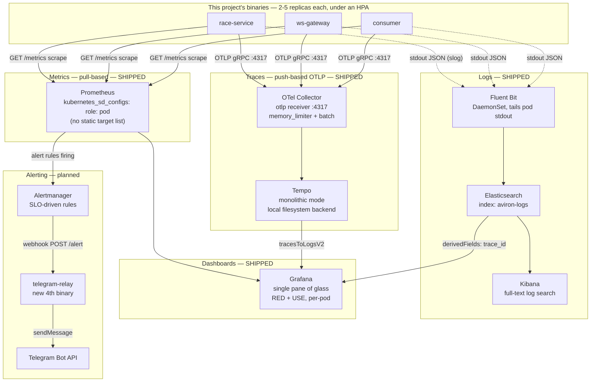
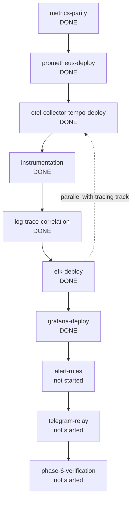
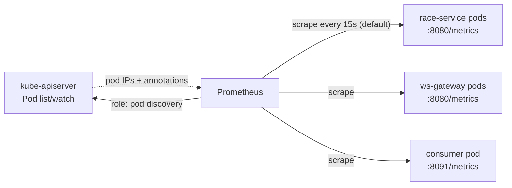
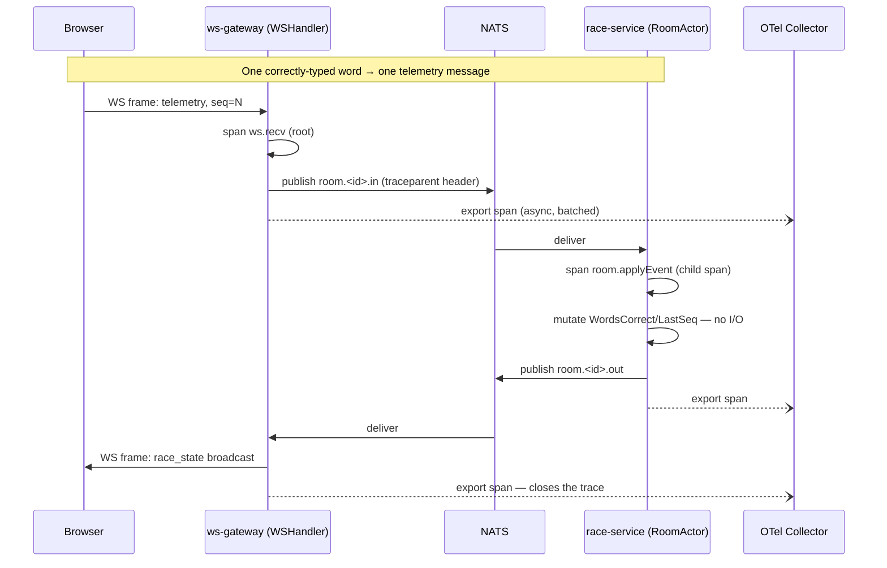
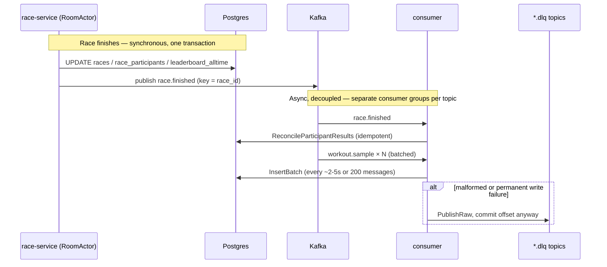
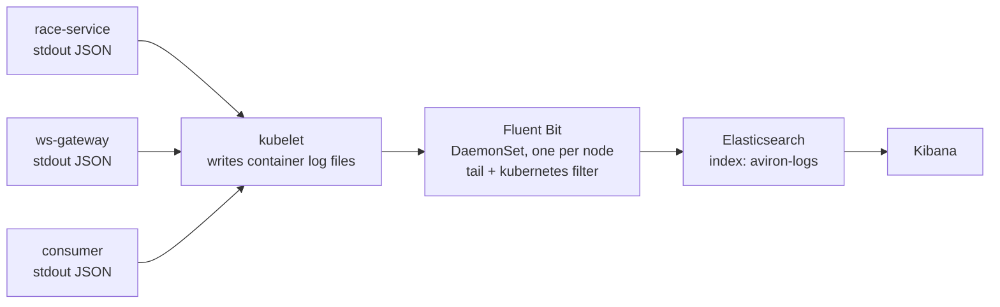
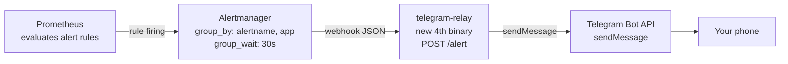
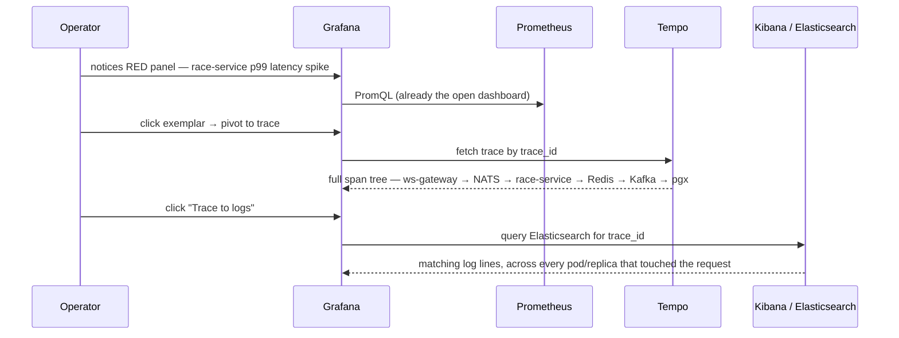

# Observability Architecture (Phase 6)

This is the project-specific companion to `docs/observability.md` (general
industry background, in Vietnamese) and the source of truth is
`context/features/phase6/phase-6-plan.md` — this doc exists to show **the
whole picture in one place, with diagrams**, of what Phase 6 actually
builds for *this* system: `race-service`, `ws-gateway`, and `consumer`,
running as 2-5 replicas each under a `HorizontalPodAutoscaler`, where a
single player action already crosses process, broker, and machine
boundaries (WebSocket → NATS → Redis → Kafka → Postgres).

## Status at a glance

| Pillar | Tool | Status | Spec |
| --- | --- | --- | --- |
| Metrics | Prometheus (pull-based) | **Shipped** | `metrics/metrics-parity.md`, `metrics/prometheus-deploy.md` |
| Traces — infra | OTel Collector + Tempo | **Shipped** | `tracing/otel-collector-tempo-deploy.md` |
| Traces — app code | OpenTelemetry SDK, full depth | **Shipped** | `tracing/instrumentation.md` |
| Logs — correlation | `trace_id` in `slog` output | **Shipped** | `logging/log-trace-correlation.md` |
| Logs — backend | EFK (Elasticsearch, Fluent Bit, Kibana) | **Shipped** | `logging/efk-deploy.md` |
| Dashboards | Grafana (RED + USE, pod-aware) | **Shipped** | `dashboards/grafana-deploy.md` |
| Alerting — rules | Prometheus alert rules + Alertmanager | Not started | `alerting/alert-rules.md` |
| Alerting — delivery | `telegram-relay` (new 4th binary) → Telegram | Not started | `alerting/telegram-relay.md` |
| End-to-end proof | Full walkthrough of every piece together | Not started | `verification/phase-6-verification.md` |

The diagrams below show the *target* architecture — as of this writing,
Metrics and the tracing infra (Collector + Tempo) are actually deployed
and verified against the live cluster (a manual test span round-tripped
through the Collector and was queryable via Tempo's `/api/search`); no
application binary sends a real span yet (`tracing/instrumentation.md`),
and nothing past that row exists in the cluster.

## The whole picture

Every one of this project's binaries feeds all four pillars simultaneously
— one `/metrics` scrape, one OTLP export, one stdout log line can all
describe the same event. Grafana is the single pane of glass that ties
them back together via `trace_id`.

Two deliberate asymmetries worth noticing in that diagram, both decided
directly with the user (`phase-6-plan.md`'s "Decisions"):

- **Metrics stay pull-based** (Prometheus scrapes `/metrics` directly)
  while **traces are push-based** (OTLP to the Collector). Real stacks
  mix transports like this rather than forcing everything through one
  pipe for architectural purity.
- **Logs skip the Collector entirely** — Fluent Bit tails each pod's
  stdout directly via the node's `kubelet`, which is the standard
  Kubernetes-native path and needs no application-side change. Routing
  logs through OTLP too would just be a second path to the same data.

## Build order

Almost linear — only two pairs can build in parallel, both because
neither has a real code/data dependency on the other yet:

`prometheus-deploy` and `otel-collector-tempo-deploy` have no dependency
on each other either (both are pure infra) — they just happen to be drawn
sequentially above because `prometheus-deploy` shipped first in practice.

## Pillar 1 — Metrics (shipped)

Pull-based: Prometheus discovers scrape targets dynamically via
`kubernetes_sd_configs` (`role: pod`), filtered to pods annotated
`prometheus.io/scrape: "true"` — not a static list, because
`race-service`/`ws-gateway` both scale 2-5 replicas under their own HPA
and a fixed list would go stale the same way `ws-gateway`'s old
`RACE_SERVICE_INSTANCES` did before dynamic backend discovery.

Each binary's own metric surface (`internal/metrics.Metrics` /
`GatewayMetrics` / `ConsumerMetrics`) instruments the infrastructure it
actually sits on top of, not just generic process stats:

| Binary | Notable metrics |
| --- | --- |
| `race-service` | `aviron_rooms_active`, `aviron_tick_latency_seconds`, `aviron_channel_buffer_used` |
| `race-service` + `ws-gateway` (shared: `internal/roomrelay`, `internal/roomlocator`) | `aviron_roomrelay_publish_*`, `aviron_roomlocator_lookup_duration_seconds` |
| `ws-gateway` | `aviron_ws_connections_active` |
| `consumer` | `aviron_kafka_consumer_lag`, `aviron_consumer_batch_insert_*`, `aviron_consumer_dlq_total` |

## Pillar 2 — Traces (infra shipped, app instrumentation not started)

Full depth, deliberately including a span per `telemetry` message (one
per correctly-typed word) — the hot path this whole project exists to
practice, naturally bounded by human typing speed (~0.4-2s/message per
player). This is the diagram that shows why tracing matters here: a
single WebSocket message's "did it get slow" question can only be
answered by following it across two processes and a message broker.

Note what's *not* in that diagram: Prometheus doesn't scrape per message
— it polls `/metrics` independently every ~15s and reads whatever
`aviron_tick_latency_seconds` accumulated since the last scrape. Traces
are per-event; metrics are aggregate. Same event, two different
resolutions.

The other real cross-process flow this project has — a race finishing —
goes through Kafka instead of NATS, and is asynchronous rather than
request/response:

Every hop in both diagrams above (NATS publish/consume, Redis
`roomlocator` lookups, Kafka produce/consume, `pgx` queries) gets its own
span once `tracing/instrumentation.md` ships — `internal/roomlocator` in
particular sits on the critical path of every room-scoped request, so its
spans matter even though Redis itself has no cross-process trace
propagation to carry.

## Pillar 3 — Logs (not started)

No application code changes beyond adding `trace_id`/`span_id` to
existing `slog` JSON lines once tracing exists — every binary already
logs structured JSON tagged with `race_id`/`user_id`/`request_id`
(Phase 3), so this pillar is "centralize what already exists," not
"build logging from scratch."

## Pillar 4 — Alerting (not started)

Real SLO-driven rules, not a generic textbook list — each one is tied to
a failure mode this exact system can actually hit (goroutine leak, HPA
stuck at `maxReplicas`, Kafka consumer lag, Postgres pool saturation as
`race-service` scales toward 5 replicas each opening its own `pgxpool`).

## Correlation — the actual payoff

The reason all four pillars exist together, not as separate tools: an
operator can start anywhere and pivot to the other two without
re-deriving context by hand. This mirrors `docs/observability.md`'s
"game bị lag" walkthrough, but wired to this project's own Grafana
datasources instead of a generic example.

## Component reference

| Component | Pillar | K8s resource | Port(s) | Image | Status |
| --- | --- | --- | --- | --- | --- |
| Prometheus | Metrics | `Deployment` | 9090 | `prom/prometheus` | Shipped |
| `race-service`/`ws-gateway`/`consumer` `/metrics` | Metrics | (existing) | 8080 / 8080 / 8091 | `aviron-backend:local` | Shipped |
| OTel Collector | Traces | `Deployment` | 4317 (OTLP gRPC), 13133 (health) | `otel/opentelemetry-collector:latest` (core, not `-contrib`) | Shipped |
| Tempo | Traces | `Deployment` | 3200 (query), 4317 (OTLP) | `grafana/tempo:latest` | Shipped |
| OTel SDK instrumentation | Traces | (app code) | n/a | `go.opentelemetry.io/otel` | Shipped |
| `trace_id` in `slog` | Logs | (app code) | n/a | n/a | Shipped |
| Elasticsearch | Logs | `StatefulSet` | 9200 | `docker.elastic.co/elasticsearch/elasticsearch:8.15.0` | Shipped |
| Fluent Bit | Logs | `DaemonSet` | n/a (tails `hostPath`) | `fluent/fluent-bit` | Shipped |
| Kibana | Logs | `Deployment` | 5601 | `docker.elastic.co/kibana/kibana:8.15.0` | Shipped |
| Grafana | Dashboards | `Deployment` | 3000 | `grafana/grafana:latest` | Shipped |
| `kube-state-metrics` | Dashboards (HPA panel) | `Deployment` | 8080 (metrics), 8081 (telemetry) | `registry.k8s.io/kube-state-metrics/kube-state-metrics:v2.19.1` | Shipped |
| Alertmanager | Alerting | `Deployment` | n/a | `prom/alertmanager` | Not started |
| `telegram-relay` (new 4th binary) | Alerting | `Deployment` | 8080 (`/alert`, `/metrics`) | `aviron-backend:local` (new `cmd/telegram-relay`) | Not started |

## Further reading

- `context/features/phase6/phase-6-plan.md` — the full design and every
  decision's reasoning.
- `context/features/phase6/*/*.md` — one spec per component above.
- `docs/observability.md` — general industry background on how large
  companies run observability platforms (Uber, Netflix, Google, Meta).
- `docs/k8s-deployment.md` — the application-plane deployment this
  observability plane sits alongside.
- `docs/knowledge-summary.md` — Phase 3's single-instance observability
  (`slog` + Prometheus + `pprof` + k6), the smaller-scale predecessor this
  phase replaces once it ships.
